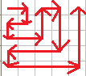
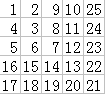

# 0088. # 88 . 纠结的矩阵

> 当前文件由 YOJ 原始题面快照的题面主体离线转换生成。公式尽量转换为 LaTeX，图片优先本地化为 Markdown 图片链接；下载失败时保留原始链接并记录 warning。
> 当前版本已完成清洗、本地门禁、YOJ Accepted 复验和源码回收，可作为公开版本。

## 题目信息

- 原题地址：[http://yoj.ruc.edu.cn/index.php/index/problem/detail/pno/88.html](http://yoj.ruc.edu.cn/index.php/index/problem/detail/pno/88.html)
- 题目时间限制（题面）：1000 ms
- 题目内存限制（题面）：256MiB
- 归档语言：`cpp17`
- 本次 AC 实际耗时（提交详情）：未记录
- 本次 AC 实际内存占用（提交详情）：未记录

---

【题目描述】

 给定一个n(n<=100)，请打印一个如下纠结的n*n的矩阵：想象一个小朋友从（1，1）的位置出发，然后按照下图给的方式不断地走下去。

 

 每走到一个点都要给这个点标号，依次标为1、2、……n*n，例如下图给出了n=5的情况。

 

 【输入格式】

 只有一行，包含一个整数n。

  【输出格式】

 n行，每行n个整数，每2个整数之间用一个空格隔开，表示标号后的矩阵。

  【样例输入】

 6

 【样例输出】

 1 2 9 10 25 26

 4 3 8 11 24 27

 5 6 7 12 23 28

 16 15 14 13 22 29

 17 18 19 20 21 30

 36 35 34 33 32 31

---

## 归档状态

- 题面转换：`CONVERTED_FROM_HTML_SNAPSHOT`
- 代码状态：`PUBLIC_READY`（清洗候选已通过发布门禁）
- 在线 AC 复验：`ONLINE_ACCEPTED`
- 直接提交分块：`VERIFIED`
