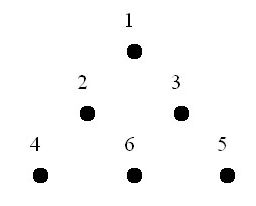

# 0117. 摘桃子

> 当前文件由 YOJ 原始题面快照的题面主体离线转换生成。公式尽量转换为 LaTeX，图片优先本地化为 Markdown 图片链接；下载失败时保留原始链接并记录 warning。
> 当前仓库阶段：`RAW_CAPTURED`。代码尚未完成脱敏清理、版本规范化、提交形态核验和在线复验。

## 题目信息

- 原题地址：[http://yoj.ruc.edu.cn/index.php/index/problem/detail/pno/117.html](http://yoj.ruc.edu.cn/index.php/index/problem/detail/pno/117.html)
- 题目时间限制（题面）：1000 ms
- 题目内存限制（题面）：256MiB
- 归档语言：`c`
- 本次 AC 实际耗时（提交详情）：65 ms
- 本次 AC 实际内存占用（提交详情）：632 KB

---

一只小猴子正在到处觅食，突然他发现一颗长满桃子的树，小猴子特别高兴就决定爬上去摘桃子吃。 　　这颗长满桃子的树很大，共有n层（最高层为第1层），第i层有i条树枝，树的形状呈一个三角形（如图）：

图中的点表示树枝，每个点上方的数字当前这条树枝最多能摘到的桃子数（小于100），在摘得某枝条的桃子之后，小猴子只能选择往左上方爬或者是往右上方爬（也就是说在摘了有6个桃子的树枝之后只能摘有2个桃子的树枝或是有3个桃子的树枝），然后继续摘桃子。小猴子现在想要从最低层开始一直爬到树顶（也就是最上面的那个枝条），摘尽可能多的桃子。请你编程帮他解决这个问题。

输入格式

包含n+1行，第一行是一个整数n（1<=n<=100），表示这颗树一共有n层。
　　第2~n+1行中，第i行有i个用空格隔开的整数，表示树上第i层中每条树枝上的桃子数。

输出格式

共有一行，包括一个整数，表示小猴子能摘到的最多的桃子数。

输入样例

3
1
2 3
4 6 5

输出样例

10

特殊提示

另一组测试数据

输入:
5
45
76 32
45 99 22
33 44 55 66
24 75 32 64 75
输出:
339

---

## 归档状态

- 题面转换：`CONVERTED_FROM_HTML_SNAPSHOT`
- 代码状态：`RAW_CAPTURED`（不可视为已清洗的公开题解）
- 在线 AC 复验：`NOT_RUN`
- 直接提交分块：`UNKNOWN_UNTIL_FORM_MAP`
