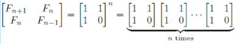

# 0118. # 118 . Fibonacci数列(提高版)

> 当前文件由 YOJ 原始题面快照的题面主体离线转换生成。公式尽量转换为 LaTeX，图片优先本地化为 Markdown 图片链接；下载失败时保留原始链接并记录 warning。
> 当前版本已完成清洗、本地门禁、YOJ Accepted 复验和源码回收，可作为公开版本。

## 题目信息

- 原题地址：[http://yoj.ruc.edu.cn/index.php/index/problem/detail/pno/118.html](http://yoj.ruc.edu.cn/index.php/index/problem/detail/pno/118.html)
- 题目时间限制（题面）：1000 ms
- 题目内存限制（题面）：256MiB
- 归档语言：`c`
- 本次 AC 实际耗时（提交详情）：未记录
- 本次 AC 实际内存占用（提交详情）：未记录

---

在Fibonacci数列中，F[0]=0，F[1]=1，F[n]=F[n-1]+F[n-2](n>=2)。举例来说，Fibonacci数列的前十个数是
　　0, 1, 1, 2, 3, 5, 8, 13, 21, 34, …
　　我们可以用利用矩阵乘法来计算Fibonacci的第n项
　　

给出一个整数n，请求出F[n]的末四位（如果后4位中前面的位上的数字为0，则不需要输出这个0，例如，后4位是0056，则输出56即可）。

输入格式

只有一行，即为整数N（0 <= N <= 1,000,000,000）。

输出格式

只有一行，为一个整数，即F[n] % 10000的余数。

输入样例

9

输出样例

34

特殊提示

【提示】
　　1、为了便于大家检查程序，再提供一组数据：n=999999999时，答案为626。
　　2、如果直接用公式f(n) = f(n-1)+f(n-2) 计算f(n)的后4位，当n很大的时候，你的程序会超时。
　　3、如果我们求2^6，可以有如下两种计算方法：
　　1）2*2*2*2*2*2
　　2）(2^2 *2)^2
　　对于第1种方法，我们需要进行5次运算，而对于第2种方法，我们仅需要进行3次运算。矩阵乘法同样可以运用这个原理。

---

## 归档状态

- 题面转换：`CONVERTED_FROM_HTML_SNAPSHOT`
- 代码状态：`PUBLIC_READY`（清洗候选已通过发布门禁）
- 在线 AC 复验：`ONLINE_ACCEPTED`
- 直接提交分块：`VERIFIED`
