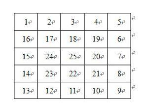

# 0124. # 124 . 滑雪

> 当前文件由 YOJ 原始题面快照的题面主体离线转换生成。公式尽量转换为 LaTeX，图片优先本地化为 Markdown 图片链接；下载失败时保留原始链接并记录 warning。
> 当前版本已完成清洗、本地门禁、YOJ Accepted 复验和源码回收，可作为公开版本。

## 题目信息

- 原题地址：[http://yoj.ruc.edu.cn/index.php/index/problem/detail/pno/124.html](http://yoj.ruc.edu.cn/index.php/index/problem/detail/pno/124.html)
- 题目时间限制（题面）：1000 ms
- 题目内存限制（题面）：256MiB
- 归档语言：`cpp`
- 本次 AC 实际耗时（提交详情）：未记录
- 本次 AC 实际内存占用（提交详情）：未记录

---

小袁非常喜欢滑雪， 因为滑雪很刺激。为了获得速度，滑的区域必须向下倾斜，而且当你滑到坡底，你不得不再次走上坡或者等待升降机来载你。小袁想知道在某个区域中最长的一个滑坡。区域由一个二维数组给出。数组的每个数字代表点的高度。如下：

一个人可以从某个点滑向上下左右相邻四个点之一，当且仅当高度减小。在上面的例子中，一条可滑行的滑坡为24-17-16-1。当然25-24-23-...-3-2-1更长。事实上，这是最长的一条。
　　你的任务就是找到最长的一条滑坡，并且将滑坡的长度输出。
　　滑坡的长度定义为经过点的个数，例如滑坡24-17-16-1的长度是4。

输入格式

输入的第一行表示区域的行数R和列数C(1<=R, C<=50)。下面是R行，每行有C个整数，依次是每个点的高度h（0<= h <=10000）。

输出格式

只有一行，为一个整数，即最长区域的长度。

输入样例

5 5
1 2 3 4 5
16 17 18 19 6
15 24 25 20 7
14 23 22 21 8
13 12 11 10 9

输出样例

25

---

## 归档状态

- 题面转换：`CONVERTED_FROM_HTML_SNAPSHOT`
- 代码状态：`PUBLIC_READY`（清洗候选已通过发布门禁）
- 在线 AC 复验：`ONLINE_ACCEPTED`
- 直接提交分块：`VERIFIED`
