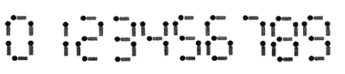

# 0131. 火柴棒等式

> 当前文件由 YOJ 原始题面快照的题面主体离线转换生成。公式尽量转换为 LaTeX，图片优先本地化为 Markdown 图片链接；下载失败时保留原始链接并记录 warning。
> 当前版本已完成清洗、本地门禁、YOJ Accepted 复验和源码回收，可作为公开版本。

## 题目信息

- 原题地址：[http://yoj.ruc.edu.cn/index.php/index/problem/detail/pno/131.html](http://yoj.ruc.edu.cn/index.php/index/problem/detail/pno/131.html)
- 题目时间限制（题面）：1000 ms
- 题目内存限制（题面）：256MiB
- 归档语言：`cpp`
- 本次 AC 实际耗时（提交详情）：341 ms
- 本次 AC 实际内存占用（提交详情）：620 KB

---

给你n根火柴棒，你可以拼出多少个形如“A + B = C”的等式？等式中的A、B、C是用火柴棒拼出的整数（若该数非零,则最高位不能是0）。用火柴棒拼数字0-9的拼法如图所示：

注意：
　　1. 加号与等号各自需要2根火柴棒
　　2. 如果A ≠B，则A + B = C与B + A = C视为不同的等式（A、B、C >= 0）
　　3. n根火柴棒必须全部用上

输入格式

共一行，有一个整数n（n<=24）。

输出格式

共一行，有一个整数，表示能拼成的不同等式的数目。

输入样例

18

输出样例

9

特殊提示

9个等式为：
　　0 + 4 = 4
　　0 + 11 = 11
　　1 + 10 = 11
　　2 + 2 = 4
　　2 + 7 = 9
　　4 + 0 = 4
　　7 + 2 = 9
　　10 + 1 = 11
　　11 + 0 = 11

---

## 归档状态

- 题面转换：`CONVERTED_FROM_HTML_SNAPSHOT`
- 代码状态：`PUBLIC_READY`（清洗候选已通过发布门禁）
- 在线 AC 复验：`ONLINE_ACCEPTED`
- 直接提交分块：`VERIFIED`
