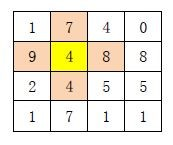

# 0141. 矩阵搜索

> 当前文件由 YOJ 原始题面快照的题面主体离线转换生成。公式尽量转换为 LaTeX，图片优先本地化为 Markdown 图片链接；下载失败时保留原始链接并记录 warning。
> 当前仓库阶段：`RAW_CAPTURED`。代码尚未完成脱敏清理、版本规范化、提交形态核验和在线复验。

## 题目信息

- 原题地址：[http://yoj.ruc.edu.cn/index.php/index/problem/detail/pno/141.html](http://yoj.ruc.edu.cn/index.php/index/problem/detail/pno/141.html)
- 题目时间限制（题面）：1000 ms
- 题目内存限制（题面）：256MiB
- 归档语言：`cpp`
- 本次 AC 实际耗时（提交详情）：81 ms
- 本次 AC 实际内存占用（提交详情）：504 KB

---

有一个m行n列的正整数矩阵，请你找出一个位置，满足下面的条件：该位置上的数字与其相邻位置上的数字之和最大。注意：相邻的位置是指有公共边的2个位置。如果有多个位置可以得到同一个最大值，则按顺序输出这多个位置。

例如：下面的矩阵中，与黄色格子相邻的４格子已经用特殊的颜色标出。注意，靠边和角落上格子的相邻格子分别是３个和２个。

输入格式

第1行，两个整数m、n，分别表示矩阵的行、列数。其中，1≤m, n≤ 100。
　　从第2行起，按行输入矩阵。
　　以空格分隔两个整数，以回车结束一行。

输出格式

输出若干行，每行两个数，以空格分隔。
　　第1行的第1个数为最大值；第2个数为最大值个数。
　　从第2行起，每行表示一个位置，表示符合条件的位置的行、列坐标（行、列均从0开始编号），请按照位置的字典序输出。

输入样例

4 4

1 7 4 0

9 4 8 8

2 4 5 5

1 7 1 1

输出样例

32 1

1 1

【样例输入2】

4 6

1 7 4 0 9 4

0 7 0 4 5 5

1 7 1 1 0 0

0 7 2 0 0 0

【样例输出2】

23 2

1 4

2 1

---

## 归档状态

- 题面转换：`CONVERTED_FROM_HTML_SNAPSHOT`
- 代码状态：`RAW_CAPTURED`（不可视为已清洗的公开题解）
- 在线 AC 复验：`NOT_RUN`
- 直接提交分块：`UNKNOWN_UNTIL_FORM_MAP`
