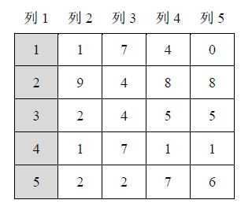

# 0142. 数据表排序

> 当前文件由 YOJ 原始题面快照的题面主体离线转换生成。公式尽量转换为 LaTeX，图片优先本地化为 Markdown 图片链接；下载失败时保留原始链接并记录 warning。
> 当前仓库阶段：`RAW_CAPTURED`。代码尚未完成脱敏清理、版本规范化、提交形态核验和在线复验。

## 题目信息

- 原题地址：[http://yoj.ruc.edu.cn/index.php/index/problem/detail/pno/142.html](http://yoj.ruc.edu.cn/index.php/index/problem/detail/pno/142.html)
- 题目时间限制（题面）：1000 ms
- 题目内存限制（题面）：256MiB
- 归档语言：`cpp`
- 本次 AC 实际耗时（提交详情）：98 ms
- 本次 AC 实际内存占用（提交详情）：628 KB

---

有一个二维数据表，表中均为整数，表中的第一例的数字没有重复，可以用来唯一标识一个行数据。

 现在希望你**以行为单位**对这个二维数据表进行排序，排序的依据是某一列或者某几列。

 

 输入格式

 第1行，两个整数m、n（2≤m, n<100），分别表示数据表的行、列数。
　　第2行，若干个整数，其中第1个整数k表示作为排序依据的列的个数。接下来k个整数，依次是作为排序依据的列的列号（列号从1开始），按照优先级从高到低的顺序给出。例如2 2 3表示按照第2列、第3列进行排序，也就是说第2列上数字相等的时候，再按照第3列上数字进行排序。特别注意：输入的排序依据列号不会包括1，但当按照给出的排序依据列无法确定数据表中两行的大小关系的时候，默认按照第1列排序。
　　第3行起的m行，每行n个整数，表示二维数据表中一行的数据，每2个整数之间用一个空格隔开。

 输出格式

 m行，每行n个整数，为排序后的m行n列数据表。

 输入样例

 5 5
1 2
1 1 7 4 0
2 9 4 8 8
3 2 4 5 5
4 1 7 1 1
5 2 2 7 6

 输出样例

 1 1 7 4 0
4 1 7 1 1
3 2 4 5 5
5 2 2 7 6
2 9 4 8 8

  特殊提示

 【样例输入2】
　　5 5
　　2 2 3
　　1 1 7 4 0
　　2 9 4 8 8
　　3 2 4 5 5
　　4 1 7 1 1
　　5 2 2 7 6
　　【样例输出2】
　　1 1 7 4 0
　　4 1 7 1 1
　　5 2 2 7 6
　　3 2 4 5 5
　　2 9 4 8 8

---

## 归档状态

- 题面转换：`CONVERTED_FROM_HTML_SNAPSHOT`
- 代码状态：`RAW_CAPTURED`（不可视为已清洗的公开题解）
- 在线 AC 复验：`NOT_RUN`
- 直接提交分块：`UNKNOWN_UNTIL_FORM_MAP`
