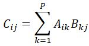

# 0149. # 149 . 矩阵乘法

> 当前文件由 YOJ 原始题面快照的题面主体离线转换生成。公式尽量转换为 LaTeX，图片优先本地化为 Markdown 图片链接；下载失败时保留原始链接并记录 warning。
> 当前版本已完成清洗、本地门禁、YOJ Accepted 复验和源码回收，可作为公开版本。

## 题目信息

- 原题地址：[http://yoj.ruc.edu.cn/index.php/index/problem/detail/pno/149.html](http://yoj.ruc.edu.cn/index.php/index/problem/detail/pno/149.html)
- 题目时间限制（题面）：1000 ms
- 题目内存限制（题面）：256MiB
- 归档语言：`cpp17`
- 本次 AC 实际耗时（提交详情）：未记录
- 本次 AC 实际内存占用（提交详情）：未记录

---

N*P阶的矩阵A与P*M阶的矩阵B的乘积C是一个N*M阶的矩阵。C的任何一个元素Cij的值为A的矩阵的第i行和B矩阵的第j列的P个对应元素的乘积之和，即

 

  其中p为A矩阵的列数,也是B矩阵的行数,又称为两个相乘矩阵的内阶数。两矩阵相乘的必要条件是内阶数相等。限定2<=i,j,p<=5。

  输入格式

 输入文件第一行包含3个整数N,P,M(2<=N,P,M<=5),每两个数间有一空格。
　　接下来的N行,每行P个整数,第i+1行的第j个整数表示A[i][j]的值，每两个数间有一空格。
　　接下来的P行,每行M个整数,第i+N+1行的第j个整数表示B[i][j]的值，每两个数间有一空格。

 输出格式

 输出文件共N行,每行M个整数，每两个数间有一空格。
　　第i行第j个整数表示C[i][j]的值

 输入样例

 3 3 3
1 1 1
1 1 1
1 1 1
1 1 1
1 1 1
1 1 1

 输出样例

 3 3 3
3 3 3
3 3 3

---

## 归档状态

- 题面转换：`CONVERTED_FROM_HTML_SNAPSHOT`
- 代码状态：`PUBLIC_READY`（清洗候选已通过发布门禁）
- 在线 AC 复验：`ONLINE_ACCEPTED`
- 直接提交分块：`VERIFIED`
