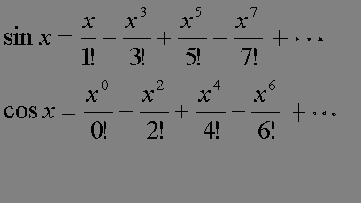

# 0180. # 180 . 计算cosx的近似值

> 当前文件由 YOJ 原始题面快照的题面主体离线转换生成。公式尽量转换为 LaTeX，图片优先本地化为 Markdown 图片链接；下载失败时保留原始链接并记录 warning。
> 当前版本已完成清洗、本地门禁、YOJ Accepted 复验和源码回收，可作为公开版本。

## 题目信息

- 原题地址：[http://yoj.ruc.edu.cn/index.php/index/problem/detail/pno/180.html](http://yoj.ruc.edu.cn/index.php/index/problem/detail/pno/180.html)
- 题目时间限制（题面）：1000 ms
- 题目内存限制（题面）：256MiB
- 归档语言：`c`
- 本次 AC 实际耗时（提交详情）：未记录
- 本次 AC 实际内存占用（提交详情）：未记录

---

编写一个程序计算sinx和cosx的近似值,使用如下的台劳级数公式 舍去的绝对值应小于ε

# 输入格式

输入文件包括2个实数x,ε，两个数间有一空格。

# 输出格式

输出文件共两行

第一行输出sinx的近似值

第二行输出cosx的近似值

# 输入样例

5 0.001

# 输出样例

-0.958776

0.284221

---

## 归档状态

- 题面转换：`CONVERTED_FROM_HTML_SNAPSHOT`
- 代码状态：`PUBLIC_READY`（清洗候选已通过发布门禁）
- 在线 AC 复验：`ONLINE_ACCEPTED`
- 直接提交分块：`VERIFIED`
