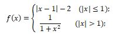

# 0292. 分段函数

> 当前文件由 YOJ 原始题面快照的题面主体离线转换生成。公式尽量转换为 LaTeX，图片优先本地化为 Markdown 图片链接；下载失败时保留原始链接并记录 warning。
> 发布阶段、在线复验和提交形态等动态状态以 [data/problems.json](../../data/problems.json) 为准；本文件只保存题面内容和来源信息。

## 题目信息

- 原题地址：[http://yoj.ruc.edu.cn/index.php/index/problem/detail/pno/292.html](http://yoj.ruc.edu.cn/index.php/index/problem/detail/pno/292.html)
- 题目时间限制（题面）：1000 ms
- 题目内存限制（题面）：256MiB
- 归档语言：`c`
- 本次 AC 实际耗时（提交详情）：72 ms
- 本次 AC 实际内存占用（提交详情）：516 KB

---

【问题描述】

 已知有如下分段离散函数f (x)，其中自变量x为[-1000, 1000]之间的实数。

 

 请编写一个程序计算函数f(f(x)) 的值。注意，当函数值有小数时四舍五入保留2位小数。

 【输入格式】

 输入一个实数x。

 【输出格式】

 输出f(f(x))函数值，当函数值有小数时四舍五入保留2位小数。

 | 【输入样例1】   0.5 | 【输入样例2】   -3 |
| --- | --- |
| 【输出样例1】   0.31 | 【输出样例2】   -1.10 |

  【注意】

 浮点数计算过程中请使用double类型。
