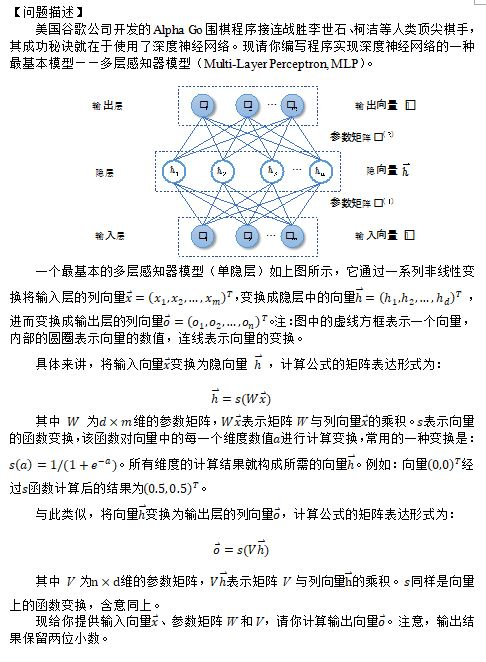
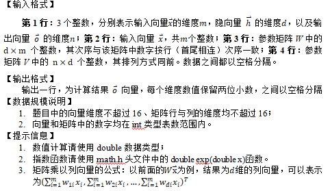

# 0295. # 295 . 深度神经网络

> 当前文件由 YOJ 原始题面快照的题面主体离线转换生成。公式尽量转换为 LaTeX，图片优先本地化为 Markdown 图片链接；下载失败时保留原始链接并记录 warning。
> 当前版本已完成清洗、本地门禁、YOJ Accepted 复验和源码回收，可作为公开版本。

## 题目信息

- 原题地址：[http://yoj.ruc.edu.cn/index.php/index/problem/detail/pno/295.html](http://yoj.ruc.edu.cn/index.php/index/problem/detail/pno/295.html)
- 题目时间限制（题面）：1000 ms
- 题目内存限制（题面）：256MiB
- 归档语言：`c`
- 本次 AC 实际耗时（提交详情）：未记录
- 本次 AC 实际内存占用（提交详情）：未记录

---

 

 | 【输入样例1】   1 1 1   1   2   -2 | 【输入样例2】   3 4 2   0 0 1   -1 1 0 -1 2 0 0 -2 2 1 0 1   1 -2 1 -2 0 -2 2 2 |
| --- | --- |
| 【输出样例1】   0.15 | 【输出样例2】   0.25 0.90 |

---

## 归档状态

- 题面转换：`CONVERTED_FROM_HTML_SNAPSHOT`
- 代码状态：`PUBLIC_READY`（清洗候选已通过发布门禁）
- 在线 AC 复验：`ONLINE_ACCEPTED`
- 直接提交分块：`VERIFIED`
