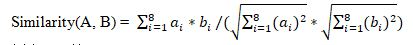

# 0307. 生辰八字

> 当前文件由 YOJ 原始题面快照的题面主体离线转换生成。公式尽量转换为 LaTeX，图片优先本地化为 Markdown 图片链接；下载失败时保留原始链接并记录 warning。
> 发布阶段、在线复验和提交形态等动态状态以 [data/problems.json](../../data/problems.json) 为准；本文件只保存题面内容和来源信息。

## 题目信息

- 原题地址：[http://yoj.ruc.edu.cn/index.php/index/problem/detail/pno/307.html](http://yoj.ruc.edu.cn/index.php/index/problem/detail/pno/307.html)
- 题目时间限制（题面）：1000 ms
- 题目内存限制（题面）：256MiB
- 归档语言：`c`
- 本次 AC 实际耗时（提交详情）：76 ms
- 本次 AC 实际内存占用（提交详情）：520 KB

---

**【问题描述】**

 大富商杨家有一女儿到了出阁的年纪，杨老爷决定面向全城适龄男士征婚。杨老爷遵循传统，决定按生辰八字作为选女婿的依据。每个应征的男士须提供自己的生辰八字，亦即八个正整数，每个数的取值范围均在[1, 24]。杨老爷特意聘请了黄半仙来算命，选择和女儿最契合的前k 个男士作为候选。黄半仙采用的算命方法是西洋传入的余弦相似度，具体做法如下：

 给定两个生辰八字A = [*a_{1}*,*a_{2}*,…,*a*_{8}]，B=[*b_{1}*,*b_{2}*,…,*b*_{8}],则

 

 例如，若A = [10,1,1,1,1,1,1,1]，B= [1,1,1,1,1,1,1,1]，则Similarity(A,B) = (10*1+1*1+…1*1)/(sqrt(10^{2}+1^{2}+…1^{2})* sqrt(1^{2}+1^{2}+…+1^{2})) = 0.5810

 黄半仙认为一个男士和小姐两人的生辰八字的余弦相似度越大，两人就越契合。

 **【输入格式】**

 第1行两个整数，n 和 k，（1 ≤ n ≤ 100, 1 ≤k ≤n），表示有n个男士应征，以及需要选择k人进入候选名单。

 第2行8个整数，表示杨小姐的生辰八字。

 后面n行，每行9个整数，第一个数字是某男士的身份证号，8位整数；后面8个数字是该男士的生辰八字。整数之间均以空格隔开。

  **【输出格式】**

 k个整数，表示契合度最好的前k 位男士的身份证号，按相似度从高到低排列。

 注意：若两个男士和小姐的相似度相同，则身份证号码大的一个排在前面。当相似度相差小于1e-10 时，认为相同。

  **【样例输入】**

 2 1

 1 1 1 1 1 1 1 1

 1012345678 1 1 1 1 1 1 1 1

 1087654321 1 1 1 1 8 8 8 8

 ****

 **【样例输出】**

 1012345678
