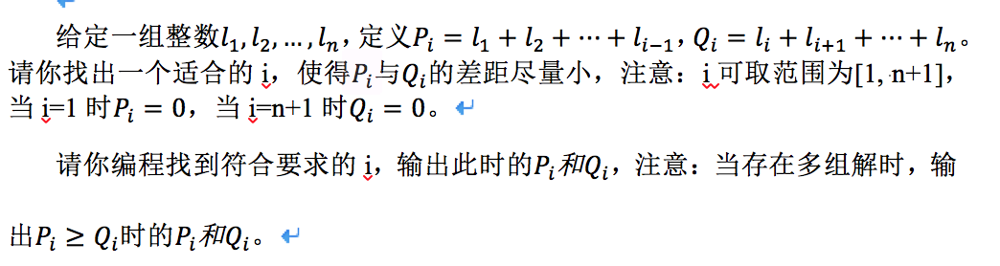

# 0460. 分割序列

> 当前文件由 YOJ 原始题面快照的题面主体离线转换生成。公式尽量转换为 LaTeX，图片优先本地化为 Markdown 图片链接；下载失败时保留原始链接并记录 warning。
> 发布阶段、在线复验和提交形态等动态状态以 [data/problems.json](../../data/problems.json) 为准；本文件只保存题面内容和来源信息。

## 题目信息

- 原题地址：[http://yoj.ruc.edu.cn/index.php/index/problem/detail/pno/460.html](http://yoj.ruc.edu.cn/index.php/index/problem/detail/pno/460.html)
- 题目时间限制（题面）：1000 ms
- 题目内存限制（题面）：256MiB
- 归档语言：`c`
- 本次 AC 实际耗时（提交详情）：80 ms
- 本次 AC 实际内存占用（提交详情）：516 KB

---

输入格式

包含2行。
　　第1行一个正整数n（n≤1000）。
　　第2行n个整数，表示l_1,l_2,…,l_n，每2个整数中间用一个空格隔开。

输出格式

1行，包含2个整数，满足题面描述的P_i与Q_i，中间用空格隔开。

输入样例

【样例输入1】
3
1 2 1
【样例输入2】
4
2 -2 3 -2

输出样例

【样例输出1】
3 1
【样例输出2】
1 0
