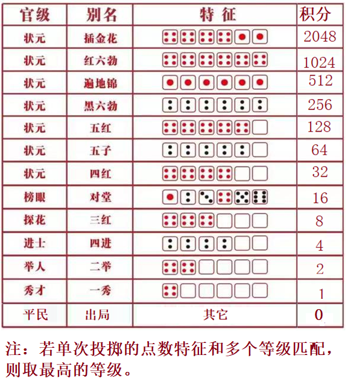

# 0636. 博饼游戏

> 当前文件由 YOJ 原始题面快照的题面主体离线转换生成。公式尽量转换为 LaTeX，图片优先本地化为 Markdown 图片链接；下载失败时保留原始链接并记录 warning。
> 发布阶段、在线复验和提交形态等动态状态以 [data/problems.json](../../data/problems.json) 为准；本文件只保存题面内容和来源信息。

## 题目信息

- 原题地址：[http://yoj.ruc.edu.cn/index.php/index/problem/detail/pno/636.html](http://yoj.ruc.edu.cn/index.php/index/problem/detail/pno/636.html)
- 题目时间限制（题面）：1000 ms
- 题目内存限制（题面）：256MiB
- 归档语言：`cpp`
- 本次 AC 实际耗时（提交详情）：79 ms
- 本次 AC 实际内存占用（提交详情）：508 KB

---

博饼是闽南地区盛行的中秋传统民俗活动。游戏时，需要6个骰子和一个大瓷碗。一般会进行多轮投掷，根据每轮投掷的骰子点数特征累计积分。如果某一轮投掷，出现规定特征以外的点数，那么游戏结束，否则继续进行。多轮投掷结束后，根据累计积分判定奖次。具体的点数特征和积分见下图。

任务：编写程序，进行博饼游戏的积分统计。

【输入格式】第一行是一个正整数n(1 ≤ n < 256)，代表最多进行n轮投掷；往后至多n行，每行6个正整数，代表每个骰子的点数

【输出格式】一个正整数，代表最终累计分（十六进制格式输出，字母小写）

【输入样例】

6

4 1 4 4 5 4

5 5 5 6 6 6

【输出样例】

20
