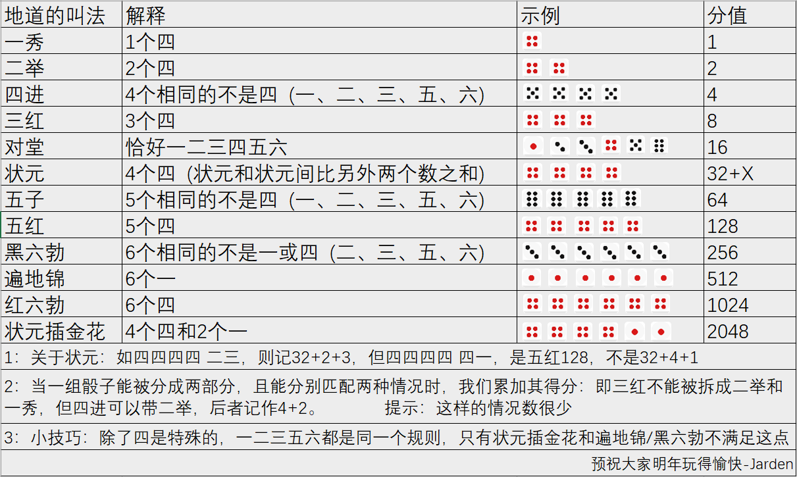

# 0637. 小图博饼

> 当前文件由 YOJ 原始题面快照的题面主体离线转换生成。公式尽量转换为 LaTeX，图片优先本地化为 Markdown 图片链接；下载失败时保留原始链接并记录 warning。
> 当前版本已完成清洗、本地门禁、YOJ Accepted 复验和源码回收，可作为公开版本。

## 题目信息

- 原题地址：[http://yoj.ruc.edu.cn/index.php/index/problem/detail/pno/637.html](http://yoj.ruc.edu.cn/index.php/index/problem/detail/pno/637.html)
- 题目时间限制（题面）：1000 ms
- 题目内存限制（题面）：256MiB
- 归档语言：`c`
- 本次 AC 实际耗时（提交详情）：78 ms
- 本次 AC 实际内存占用（提交详情）：396 KB

---

(Provided by 潘俊达 21级图灵班）

图灵金科班正在举办一年一度的博饼活动，这次Jarden教给了大家正确的规则，为了加速活动的进行，也增加活动的刺激程度，主持人为每桌准备了两副骰子共12个骰子（不要问我为什么这样可以加快，问就量子力学）。现在轮到了小图，很快啊，小图把手里的6个骰子扔进了碗里，但是他没发现碗里上一次掷的6个骰子还没取出来，现在其他所有人都不知道哪些是哪次掷的，除了小图本人，于是大家来问小图，小图这次决定撒个谎，他现在想知道怎么回答能让他的积分最大，但是他看不出来，于是决定问你，他答应你，只要你回答正确了，就给你一半的奖品。

于此同时，另一个平行宇宙中发生了一件事情：上一个掷骰子的小金悄悄把头凑向了小图，说：“我其实记得我上次掷出了什么，如果你报出来后，我的积分变少了，我就告发你。”小图更慌了，他知道他要是被告发那就要被千夫所指了呀，所以他问你：怎么回答能够安全地拿到最多积分。

【输入格式】共2行，每行6个数，先后代表小金和小图掷出的6个骰子

【输出格式】两个正整数，先后表示两个平行宇宙你的方案能拿到的最大积分，数字中间中间用空格分开

【输入样例】

1 2 3 4 5 5

1 2 6 4 4 4

【输出样例】

2048 16

---

## 归档状态

- 题面转换：`CONVERTED_FROM_HTML_SNAPSHOT`
- 代码状态：`PUBLIC_READY`（清洗候选已通过发布门禁）
- 在线 AC 复验：`ONLINE_ACCEPTED`
- 直接提交分块：`VERIFIED`
