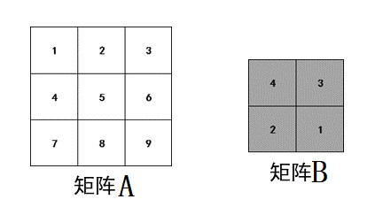
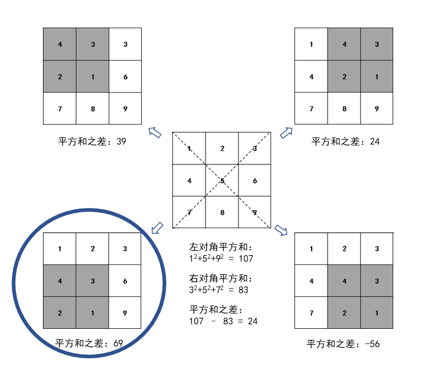

# 0660. # 660 . 矩阵局部替换

> 当前文件由 YOJ 原始题面快照的题面主体离线转换生成。公式尽量转换为 LaTeX，图片优先本地化为 Markdown 图片链接；下载失败时保留原始链接并记录 warning。
> 当前版本已完成清洗、本地门禁、YOJ Accepted 复验和源码回收，可作为公开版本。

## 题目信息

- 原题地址：[http://yoj.ruc.edu.cn/index.php/index/problem/detail/pno/660.html](http://yoj.ruc.edu.cn/index.php/index/problem/detail/pno/660.html)
- 题目时间限制（题面）：2000 ms
- 题目内存限制（题面）：256MiB
- 归档语言：`cpp17-clang`
- 本次 AC 实际耗时（提交详情）：未记录
- 本次 AC 实际内存占用（提交详情）：未记录

---

【问题描述】

给定一个n * n的矩阵A和一个m * m的矩阵B（m < n）。用B替换对A进行局部替换，即在A中找一个m * m的子矩阵，将子矩阵元素的值用B中元素替换。求所有可能的局部替换方案中，使得替换后的矩阵左对角线各数的平方和与右对角线各数的平方和差值最大。输出最大的差值。

例如：下列在3*3的矩阵A中寻找一个2*2的子矩阵，用矩阵B替换子矩阵。共有4中替换方案，如下图所示。每种方案的左对角线各数的平方和与右对角线各数的平方和差值分别为39、24、69、-56，差值的最大值为69。

【输入格式】

第1行：两个正整数n m

第2 ~ n+1行：每行n列，形成一个n * n矩阵

第n+2 ~ n+m+1行：每行m列，形成一个m * m矩阵

**【**输出格式**】**

共1行，含一个整数，所有局部替换方案中最大的左右对角线平方和差值。

**【**数据范围**】**

1< m < n ≤ 1000，矩阵中的元素均为整数，取值范围[-1e18, 1e18]

【输入样例1】

3 2

1 2 3

4 5 6

7 8 9

4 3

2 1

【输出样例1】

69

【输入样例2】

4 2

1 6 5 3

2 5 6 9

5 8 9 4

8 3 2 1

4 6

8 2

【输出样例2】

6

---

## 归档状态

- 题面转换：`CONVERTED_FROM_HTML_SNAPSHOT`
- 代码状态：`PUBLIC_READY`（清洗候选已通过发布门禁）
- 在线 AC 复验：`ONLINE_ACCEPTED`
- 直接提交分块：`VERIFIED`
