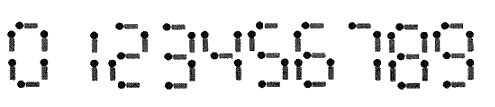
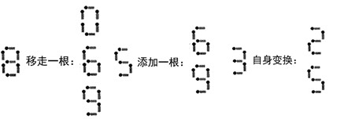
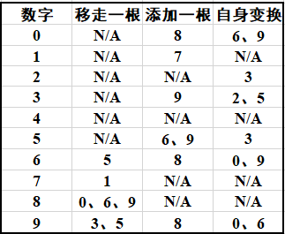

# 0661. 移动火柴

> 当前文件由 YOJ 原始题面快照的题面主体离线转换生成。公式尽量转换为 LaTeX，图片优先本地化为 Markdown 图片链接；下载失败时保留原始链接并记录 warning。
> 当前版本已完成清洗、本地门禁、YOJ Accepted 复验和源码回收，可作为公开版本。

## 题目信息

- 原题地址：[http://yoj.ruc.edu.cn/index.php/index/problem/detail/pno/661.html](http://yoj.ruc.edu.cn/index.php/index/problem/detail/pno/661.html)
- 题目时间限制（题面）：1000 ms
- 题目内存限制（题面）：256MiB
- 归档语言：`cpp`
- 本次 AC 实际耗时（提交详情）：72 ms
- 本次 AC 实际内存占用（提交详情）：504 KB

---

【问题描述】

移动一根火柴使得给定的形如“A+B=C”或者“A-B=C”的算术运算式成立。

用火柴棒拼数字0-9的拼法如图所示：

****

注意：

l 可以移动数字上的火柴，但需保证移动后所有的数字仍是有效的数字

l +运算符可以移走一根火柴，变成-运算符

l -运算符可以添加一根火柴，变成+运算符

l 不能在数字前面添加火柴，使其变为负数

l =运算符的火柴不能移走，也不能添加

****

****

数字火柴移动示例：

数字火柴的所有可行移动方案：

【输入格式】

一行字符串，形如“A+B=C”或者“A-B=C”的算术运算式。

A、B、C为0~9的数字字符。

【输出格式】

输出移动一根火柴后成立的等式A’±B’=C’，所有测试用例均保证有解。

l 如果有多组解则依次按照A’、B’、C’从小到大的顺序输出解。

l 如果有多种移动方案产生相同的等式A’±B’=C’，只需输出一次。

| 【输入样例1】8-2=2 【输出样例1】8-5=5 | 【输入样例2】0+2=2 【输出样例2】0+5=58-3=58-5=3 |
| --- | --- |

【特别说明】

此题有部分得分，只要输出的解均为正确解，即便没有求得所有的可行解，或未按要求进行排序，亦获得该测试点50%的分数。

---

## 归档状态

- 题面转换：`CONVERTED_FROM_HTML_SNAPSHOT`
- 代码状态：`PUBLIC_READY`（清洗候选已通过发布门禁）
- 在线 AC 复验：`ONLINE_ACCEPTED`
- 直接提交分块：`VERIFIED`
