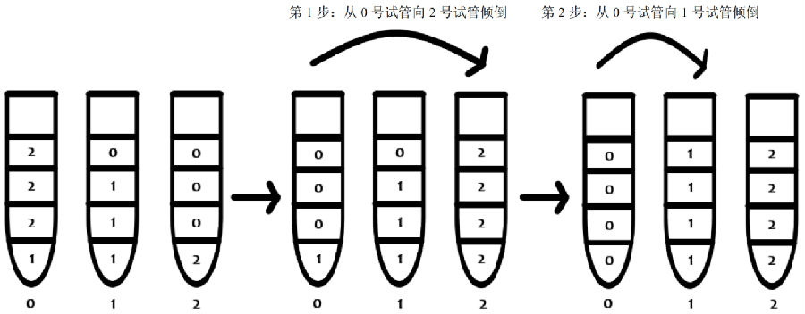

# 0767. #5_tube

> 当前文件由 YOJ 原始题面快照的题面主体离线转换生成。公式尽量转换为 LaTeX，图片优先本地化为 Markdown 图片链接；下载失败时保留原始链接并记录 warning。
> 当前版本已完成清洗、本地门禁、YOJ Accepted 复验和源码回收，可作为公开版本。

## 题目信息

- 原题地址：[http://yoj.ruc.edu.cn/index.php/index/problem/detail/pno/767.html](http://yoj.ruc.edu.cn/index.php/index/problem/detail/pno/767.html)
- 题目时间限制（题面）：1000 ms
- 题目内存限制（题面）：512MiB
- 归档语言：`cpp`
- 本次 AC 实际耗时（提交详情）：130 ms
- 本次 AC 实际内存占用（提交详情）：3120 KB

---

**五、液体试管拼图**

【问题描述】

“液体试管拼图”是一款非常流行的益智类游戏。游戏规则简述如下：有n根试管，每根试管自底部向上装有若干份颜色各异的液体；玩家要将液体在多根试管之间倾倒，最终使得相同颜色的液体全部在一根试管中。从试管x向试管y号倾倒液体应同时满足如下条件：①.试管x中有液体；②.试管y还有剩余容量；③.试管y中没有液体或其顶部液体的颜色与试管x顶部液体的颜色相同。进行倾倒时，只要试管y容量未满，就要将试管x顶部相同颜色的多份液体一次性倒完。

请编程求解如下问题：给定n根试管初始时的液体分布情况，求使相同颜色的液体全部在一根试管中所需要的最少倾倒步数，并输出每一步如何进行倾倒。为了简化操作，有如下规定：每根试管的容量为4（即最多允许放4份液体，无论颜色是否相同）；每种颜色的液体份数为4；试管根数不超过10；所有试管中的液体份数总和不超过20。

【输入格式】

第一行一个正整数n，表示有几根试管。

接下来的n行，每行4个数字，代表每根试管自底部向上每一层的液体颜色，其中，0代表没有液体。

【输出格式】

第一行输出最少倾倒歩数m。

接下来m行，每行2个数字x, y，代表从x号试管倾倒向y号试管。

| 【输入样例】31 2 2 21 1 1 02 0 0 0 | 【输出样例】20 20 1 |
| --- | --- |

【样例解释】

【注意事项】

1. 此题有部分得分，输出的最少倾倒歩数正确可以获得50%的分数。

2. 如果有多种最优倾倒方案，输出任意一种即可。

---

## 归档状态

- 题面转换：`CONVERTED_FROM_HTML_SNAPSHOT`
- 代码状态：`PUBLIC_READY`（清洗候选已通过发布门禁）
- 在线 AC 复验：`ONLINE_ACCEPTED`
- 直接提交分块：`VERIFIED`
