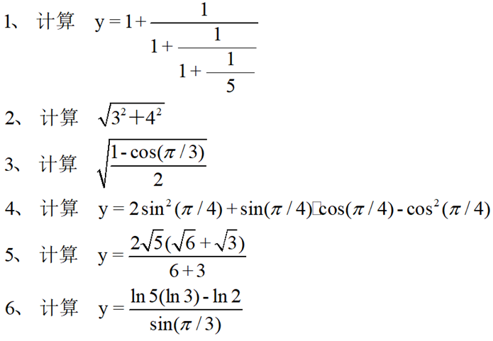

# 0828. calculate

> 当前文件由 YOJ 原始题面快照的题面主体离线转换生成。公式尽量转换为 LaTeX，图片优先本地化为 Markdown 图片链接；下载失败时保留原始链接并记录 warning。
> 发布阶段、在线复验和提交形态等动态状态以 [data/problems.json](../../data/problems.json) 为准；本文件只保存题面内容和来源信息。

## 题目信息

- 原题地址：[http://yoj.ruc.edu.cn/index.php/index/problem/detail/pno/828.html](http://yoj.ruc.edu.cn/index.php/index/problem/detail/pno/828.html)
- 题目时间限制（题面）：1000 ms
- 题目内存限制（题面）：256MiB
- 归档语言：`cpp`
- 本次 AC 实际耗时（提交详情）：7 ms
- 本次 AC 实际内存占用（提交详情）：372 KB

---

请编写程序计算上述6个算式的结果

**【输入格式】**

（本题无输入）

**【输出格式】**

输出6行，第i行包含一个第i个算式的结果，精确到0.001

**【Hint】**

本题主要考察同学们对数学库函数的调用
