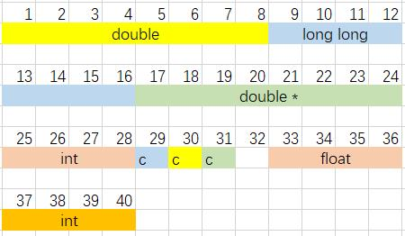

# 0829. 最小结构体

> 当前文件由 YOJ 原始题面快照的题面主体离线转换生成。公式尽量转换为 LaTeX，图片优先本地化为 Markdown 图片链接；下载失败时保留原始链接并记录 warning。
> 当前仓库阶段：`RAW_CAPTURED`。代码尚未完成脱敏清理、版本规范化、提交形态核验和在线复验。

## 题目信息

- 原题地址：[http://yoj.ruc.edu.cn/index.php/index/problem/detail/pno/829.html](http://yoj.ruc.edu.cn/index.php/index/problem/detail/pno/829.html)
- 题目时间限制（题面）：1000 ms
- 题目内存限制（题面）：256MiB
- 归档语言：`cpp`
- 本次 AC 实际耗时（提交详情）：150 ms
- 本次 AC 实际内存占用（提交详情）：504 KB

---

C/C++语言中结构体内部的变量顺序可能会导致该结构体在内存中所占的字节数不同。现在给定一个结构体，请你计算，通过改变结构体内部变量的顺序，能够得到的占用最小字节数的方案，输出最小占用的字节数及其对应的排列方式。

结构体所占大小是根据如下两条规则计算的：

- 从前往后扫描结构体，每个元素的起始地址需要是当前元素占用字节数的整数倍。
- 整个结构体所占的内存大小需要是这个结构体中占用字节数最多的成员大小的整数倍。

结构体中第一个变量的起始地址可以被认为是0。

为了统一标准，将可能设计的变量类型及其占用的内存字节数做如下约定：

| 变量类型 | 字节数 |
| --- | --- |
| char | 1 |
| bool | 1 |
| short | 2 |
| int | 4 |
| float | 4 |
| long | 4 |
| long long | 8 |
| double | 8 |
| long double | 16 |
| 指针（形如：“[变量类型] *”，如“long long *”） | 8 |

**输入格式**

第一行包含一个正整数n（1 <= n <= 10），表示该结构体涉及的变量类型的数量。

接下来n行，每行由两个部分组成：第一部分为一个字符串，表示变量类型的名称；第二部分为一个正整数x（1 <= x <= 1000），表示该种变量类型的变量的数量。两个部分之间由一个空格隔开。

**输出格式**

第一行包含一个正整数S，表示该结构体占用最小内存字节数。

接下来若干行为一种符合要求的排列方式。每一行由两个部分组成：第一部分为一个字符串，表示变量类型的名称；第二部分为一个正整数，表示该种变量类型的变量的数量。两个部分之间由一个空格隔开。

如果有多种符合要求的排列方式，输出任意一种即可。

**样例输入**

****

```
6
int 2
long long 1
double 1
double * 1
char 3
float 1
```

**样例输出**

```
40
double 1
long long 1
double * 1
int 1
char 3
float 1
int 1
```

**样例解释**

下图中，每个格子表示一个字节，c表示char。



---

## 归档状态

- 题面转换：`CONVERTED_FROM_HTML_SNAPSHOT`
- 代码状态：`RAW_CAPTURED`（不可视为已清洗的公开题解）
- 在线 AC 复验：`NOT_RUN`
- 直接提交分块：`UNKNOWN_UNTIL_FORM_MAP`
