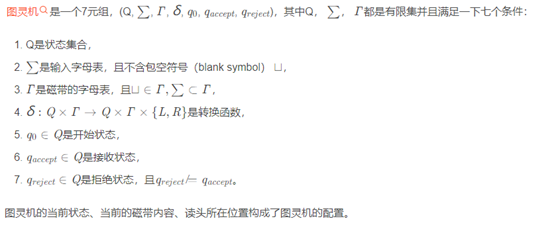
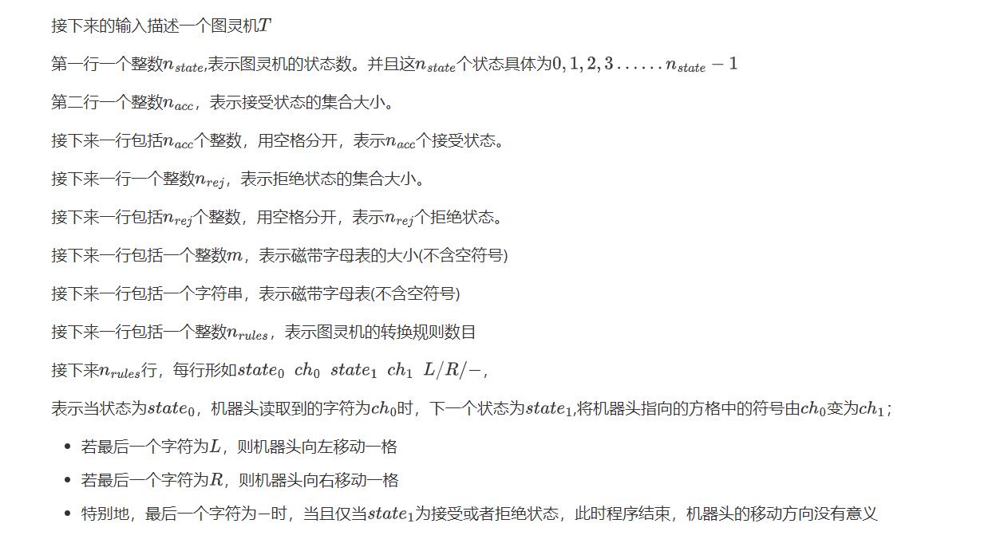
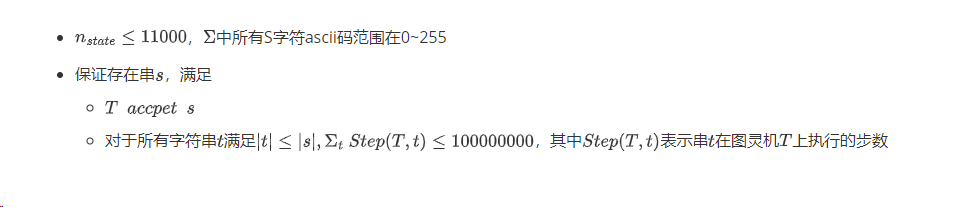

# 0832. Turing Machine

> 当前文件由 YOJ 原始题面快照的题面主体离线转换生成。公式尽量转换为 LaTeX，图片优先本地化为 Markdown 图片链接；下载失败时保留原始链接并记录 warning。
> 当前仓库阶段：`RAW_CAPTURED`。代码尚未完成脱敏清理、版本规范化、提交形态核验和在线复验。

## 题目信息

- 原题地址：[http://yoj.ruc.edu.cn/index.php/index/problem/detail/pno/832.html](http://yoj.ruc.edu.cn/index.php/index/problem/detail/pno/832.html)
- 题目时间限制（题面）：1000 ms
- 题目内存限制（题面）：512MiB
- 归档语言：`c`
- 本次 AC 实际耗时（提交详情）：138 ms
- 本次 AC 实际内存占用（提交详情）：1560 KB

---

【题目描述】

因为本题与图灵机有关，接下来将介绍一些图灵机的前置知识。

图灵机有一条无限长的纸带，纸带分成了一个一个的小方格。有一个机器头在纸带上移来移去。机器头有一组内部状态，还有一些固定的程序。在每个时刻，机器头都要从当前纸带上读入一个方格信息，然后结合自己的内部状态查找程序表，根据程序输出信息到纸带方格上，并转换自己的内部状态，然后进行移动。**当进入接收状态或者拒绝状态时，程序结束**。

下面是图灵机形式化的定义



现在，给定一个图灵机T，试给出被T接受的一个输入状态（当一组输入通过图灵机上的操作最后进入接受状态时，即认为该输入被图灵机接受）

【输入格式】



【输出格式】

第一行包括机器头指向的位置

第二行包括初始状态下的纸带（右侧的空字符可以省略

【输入示例】

```
4
1
3
0
2
01
4
0 0 1 1 R
1 1 2 1 R
2 1 2 1 R
2 0 3 1 –
```

【输出示例】

```
1
#010
```

【样例解释】

该图灵机接受形如01……10的串

【数据范围】



---

## 归档状态

- 题面转换：`CONVERTED_FROM_HTML_SNAPSHOT`
- 代码状态：`RAW_CAPTURED`（不可视为已清洗的公开题解）
- 在线 AC 复验：`NOT_RUN`
- 直接提交分块：`UNKNOWN_UNTIL_FORM_MAP`
