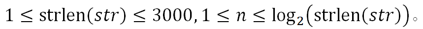

# 0877. 字符串衰减

> 当前文件由 YOJ 原始题面快照的题面主体离线转换生成。公式尽量转换为 LaTeX，图片优先本地化为 Markdown 图片链接；下载失败时保留原始链接并记录 warning。
> 当前仓库阶段：`RAW_CAPTURED`。代码尚未完成脱敏清理、版本规范化、提交形态核验和在线复验。

## 题目信息

- 原题地址：[http://yoj.ruc.edu.cn/index.php/index/problem/detail/pno/877.html](http://yoj.ruc.edu.cn/index.php/index/problem/detail/pno/877.html)
- 题目时间限制（题面）：1000 ms
- 题目内存限制（题面）：256MiB
- 归档语言：`c`
- 本次 AC 实际耗时（提交详情）：67 ms
- 本次 AC 实际内存占用（提交详情）：500 KB

---

【问题描述】

给定一个字符串*str*，对其进行*n*轮衰减。每一轮衰减后会产生新的字符串，将新的字符串代入下一轮的衰减。奇数轮衰减只保留下标是奇数的字符，偶数轮衰减只保留下标是偶数的字符。特别注意：衰减轮数从1开始编号，字符串下标从0开始编号。你的目标是求出字符串*str*经过*n*轮衰减后得到的字符串。

【输入格式】

第一行是一个以换行结尾的字符串（可能包含空格），代表要被衰减的字符串*str*。

第二行一个整数*n*，代表要进行*n*轮衰减。

**【**输出格式**】**

输出一行字符串，代表字符串*str*经过*n*轮衰减后得到的字符串。

**【**数据范围**】**

| 【输入样例】abcdefghijklmn4 | 【输出样例】f |
| --- | --- |

【样例解释】

第1轮，对字符串abcdefghijklmn进行衰减，只保留下标是奇数的字符，得到字符串bdfhjln；

第2轮，对字符串bdfhjln进行衰减，只保留下标是偶数的字符，得到字符串bfjn；

第3轮，对字符串bfjn进行衰减，只保留下标是奇数的字符，得到字符串fn；

第4轮，对字符串fn进行衰减，只保留下标是偶数的字符，得到字符串f。

---

## 归档状态

- 题面转换：`CONVERTED_FROM_HTML_SNAPSHOT`
- 代码状态：`RAW_CAPTURED`（不可视为已清洗的公开题解）
- 在线 AC 复验：`NOT_RUN`
- 直接提交分块：`UNKNOWN_UNTIL_FORM_MAP`
