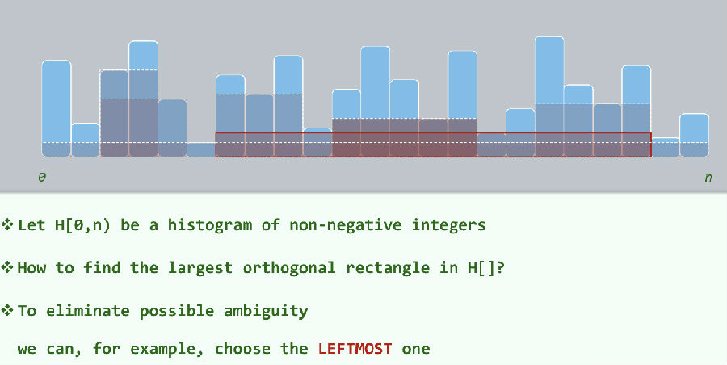

# 0962. 直方图内最大矩形

> 当前文件由 YOJ 原始题面快照的题面主体离线转换生成。公式尽量转换为 LaTeX，图片优先本地化为 Markdown 图片链接；下载失败时保留原始链接并记录 warning。
> 发布阶段、在线复验和提交形态等动态状态以 [data/problems.json](../../data/problems.json) 为准；本文件只保存题面内容和来源信息。

## 题目信息

- 原题地址：[http://yoj.ruc.edu.cn/index.php/index/problem/detail/pno/962.html](http://yoj.ruc.edu.cn/index.php/index/problem/detail/pno/962.html)
- 题目时间限制（题面）：1000 ms
- 题目内存限制（题面）：256MiB
- 归档语言：`cpp17`
- 本次 AC 实际耗时（提交详情）：985 ms
- 本次 AC 实际内存占用（提交详情）：23972 KB

---

给定一张直方图内含n个矩形,每个矩形的宽均为1, 长度给定为H[t], 请你在此不规则图形中圈出一个最大的矩形,并输出此矩形的面积.

[输入样例]

3

3 2 1

[输出样例]

4

[样例解释]

取第一个矩形的下2/3和第二个矩形组成一个矩形,可以获得面积为4的最大矩形

[数据范围]

0<n<1e7, 矩形长度H[t]均为int正整数.

温馨提示:

1. 为了避免因为输入影响运行速度,请使用scanf, 快读或者ios::sync_with_stdio(false)加快读取速度.
2. oj自动测评仅用于检查代码正确性.
