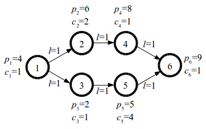

# 1094. # 1094 . 旅游

> 当前文件由 YOJ 原始题面快照的题面主体离线转换生成。公式尽量转换为 LaTeX，图片优先本地化为 Markdown 图片链接；下载失败时保留原始链接并记录 warning。
> 当前版本已完成清洗、本地门禁、YOJ Accepted 复验和源码回收，可作为公开版本。

## 题目信息

- 原题地址：[http://yoj.ruc.edu.cn/index.php/index/problem/detail/pno/1094.html](http://yoj.ruc.edu.cn/index.php/index/problem/detail/pno/1094.html)
- 题目时间限制（题面）：1000 ms
- 题目内存限制（题面）：256MiB
- 归档语言：`cpp17`
- 本次 AC 实际耗时（提交详情）：未记录
- 本次 AC 实际内存占用（提交详情）：未记录

---

【题目描述】

Q市是一个旅游城市，具有n个景点和m条道路，所有景点编号为 1,2,...,n。每条道路连接这 n 个景区中的某两个景区，道路是单向通行的。每条道路都有一个长度。

为了方便旅游，每个景点都有一个加油站。第 i 个景点的加油站的费用为 p_{i}，加油量为 c_{i}。若汽车在第 i 个景点加油，则需要花费 p_{i} 元钱，之后车的油量将被加至油量上限与 c_{i} 中的较小值。不过如果加油前汽车油量已经不小于 c_{i}，则不能在该景点加油。

小 C 准备来到 T 城旅游。他的汽车油量上限为 C。旅游开始时，汽车的油量为 0。在旅游过程中：

1、当汽车油量大于 0 时，汽车可以沿从当前景区出发的任意一条道路到达另一个景点（不能只走道路的一部分），汽车油量将减少 1；

2、当汽车在景点 i 且当前油量小于 c_{i} 时，汽车可以在当前景点加油，加油需花费 p_{i} 元钱，这样汽车油量将变为min(c_{i},C)

一次旅游的总花费等于每次加油的花费之和，旅游的总路程等于每次经过道路的长度之和。注意多次在同一景点加油，费用也要计算多次，同样地，多次经过同一条道路，路程也要计算多次。

小 C 计划旅游 T 次，每次旅游前，小 C 都指定了该次旅游的起点和目标路程。由于行程不同，每次出发前带的钱也不同。为了省钱，小 C 需要在旅游前先规划好旅游路线（包括旅游的路径和加油的方案），使得从起点出发，按照该旅游路线旅游结束后总路程不小于目标路程，且剩下的钱尽可能多。请你规划最优旅游路线，计算这 T 次旅游每次结束后最多可以剩下多少钱。

【输入描述】

输入第一行包含四个正整数 n，m，C，T，每两个整数之间用一个空格隔开，分别表示景点数、道路数、汽车油量上限和旅行次数。

接下来 n 行，每行包含两个正整数 p_{i}，ci，每两个整数之间用一个空格隔开，按编号顺序依次表示编号为 1,2,...,n 的景点的费用和油量。

接下来 m 行，每行包含三个正整数 a_{i}，b_{i}，l_{i}，每两个整数之间用一个空格隔开，表示一条从编号为 a_{i} 的景点到编号为 b_{i} 的景点的道路，道路的长度为 l_{i}。保证 a_{i} ≠ b_{i}，但从一个景点到另一个景点可能有多条道路。

最后 T 行，每行包含三个正整数 s_{i}，q_{i}，d_{i}，描述一次旅游计划，旅游的起点为编号为 s_{i} 的景点，出发时带了 q_{i} 元钱，目标路程为 d_{i}。

【输出格式】

输出 T 行，每行一个整数，第 i 行的整数表示第 i 次旅游结束后最多剩下多少元钱。如果旅游无法完成，也就是说不存在从景点 s_{i} 出发用不超过 q_{i} 元钱经过不小于 d_{i} 的路程的路线，则该行输出 -1。

【输入样例】

6 6 3 2

4 1

6 2

2 1

8 1

5 4

9 1

1 2 1

1 3 1

2 4 1

3 5 1

4 6 1

5 6 1

1 12 3

1 9 3

【输出样例】

2

-1

【样例描述】

T 城的景区和道路如下图所示：

由图可知，从景点 1 出发，路程为 3 的路线有两条：1 → 2→ 4→ 6 和 1→ 3→ 5→ 6。

第 1 次旅游，最优路线为先在景点 1 加油，花费 4 元，此时油量为 1，然后到景点 2，此时油量为 0，在景点 2 加油，花费 6 元，此时油量为 2，接着到景点 4，此时油量为 1，最后到景点 6，总路程为 3，最后剩余 12-4-6=2 元。

第 2 次旅游，只用 9 元无论如何也无法走 3 的路程，因此旅游无法完成。

【数据范围】

对于所有数据，2<=n<=100, 1<=C,T<=1e5, 1<=a_{i}, b_{i}<=n, 1<=p_{i},c_{i}<=1e5, 1<=s_{i}<=n, 1<=q_{i}<=n^2, 1<=d_{i}<=1e9.

---

## 归档状态

- 题面转换：`CONVERTED_FROM_HTML_SNAPSHOT`
- 代码状态：`PUBLIC_READY`（清洗候选已通过发布门禁）
- 在线 AC 复验：`ONLINE_ACCEPTED`
- 直接提交分块：`VERIFIED`
