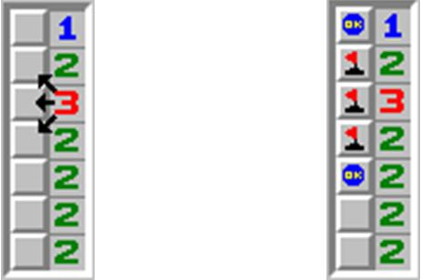

# 1097. 扫雷

> 当前文件由 YOJ 原始题面快照的题面主体离线转换生成。公式尽量转换为 LaTeX，图片优先本地化为 Markdown 图片链接；下载失败时保留原始链接并记录 warning。
> 当前版本已完成清洗、本地门禁、YOJ Accepted 复验和源码回收，可作为公开版本。

## 题目信息

- 原题地址：[http://yoj.ruc.edu.cn/index.php/index/problem/detail/pno/1097.html](http://yoj.ruc.edu.cn/index.php/index/problem/detail/pno/1097.html)
- 题目时间限制（题面）：1000 ms
- 题目内存限制（题面）：256MiB
- 归档语言：`cpp17`
- 本次 AC 实际耗时（提交详情）：97 ms
- 本次 AC 实际内存占用（提交详情）：616 KB

---

【题目描述】

相信大家都玩过扫雷的游戏。那是在一个 n x m 的矩阵里面有一些雷，要你根据一些信息找出雷来。

现在有一种简单的扫雷游戏，这个游戏规则和扫雷一样，如果某个格子没有雷，那么它里面的数字表示和它 8 连通的格子里面雷的数目。现在棋盘是 n x 2 的，第一列里面某些格子是雷，而第二列没有雷。

由于第一列的雷可能有多种方案满足第二列的数的限制，你的任务即根据第二列的信息确定第一列雷有多少种摆放方案。

【输入格式】

第一行为 N，第二行有 N 个数，依次为第二列的格子中的数。

【输出格式】

一个数，即第一列中雷的摆放方案数。

【输入样例】

2

1 1

【输出样例】

2

【数据范围与提示】

1 <= N <= 1e5

---

## 归档状态

- 题面转换：`CONVERTED_FROM_HTML_SNAPSHOT`
- 代码状态：`PUBLIC_READY`（清洗候选已通过发布门禁）
- 在线 AC 复验：`ONLINE_ACCEPTED`
- 直接提交分块：`VERIFIED`
