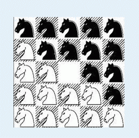

# 1103. 骑士精神

> 当前文件由 YOJ 原始题面快照的题面主体离线转换生成。公式尽量转换为 LaTeX，图片优先本地化为 Markdown 图片链接；下载失败时保留原始链接并记录 warning。
> 当前版本已完成清洗、本地门禁、YOJ Accepted 复验和源码回收，可作为公开版本。

## 题目信息

- 原题地址：[http://yoj.ruc.edu.cn/index.php/index/problem/detail/pno/1103.html](http://yoj.ruc.edu.cn/index.php/index/problem/detail/pno/1103.html)
- 题目时间限制（题面）：1000 ms
- 题目内存限制（题面）：256MiB
- 归档语言：`c`
- 本次 AC 实际耗时（提交详情）：962 ms
- 本次 AC 实际内存占用（提交详情）：632 KB

---

【题目描述】

在一个 5 x 5 的棋盘上有 12 个白色的骑士和 12 个黑色的骑士， 且有一个空位。在任何时候一个骑士都能按照骑士的走法（它可以走到和它横坐标相差为 1，纵坐标相差为 2 或者横坐标相差为 2，纵坐标相差为 1 的格子）移动到空位上。

给定一个初始的棋盘，怎样才能经过移动变成如下目标棋盘：

为了体现出骑士精神，他们必须以最少的步数完成任务。

【输入格式】

第一行有一个正整数 T，表示一共有 N 组数据。

接下来有 T 个 5 x 5 的矩阵，0 表示白色骑士，1 表示黑色骑士，*表示空位。两组数据之间没有空行。

【输出格式】

对于每组数据都输出一行。如果能在 15 步以内（包括 15 步）到达目标状态，则输出步数，否则输出 -1。

【输入样例】

2

10110

01*11

10111

01001

00000

01011

110*1

01110

01010

00100

【输出样例】

7

-1

【数据范围】

T <= 10

---

## 归档状态

- 题面转换：`CONVERTED_FROM_HTML_SNAPSHOT`
- 代码状态：`PUBLIC_READY`（清洗候选已通过发布门禁）
- 在线 AC 复验：`ONLINE_ACCEPTED`
- 直接提交分块：`VERIFIED`
