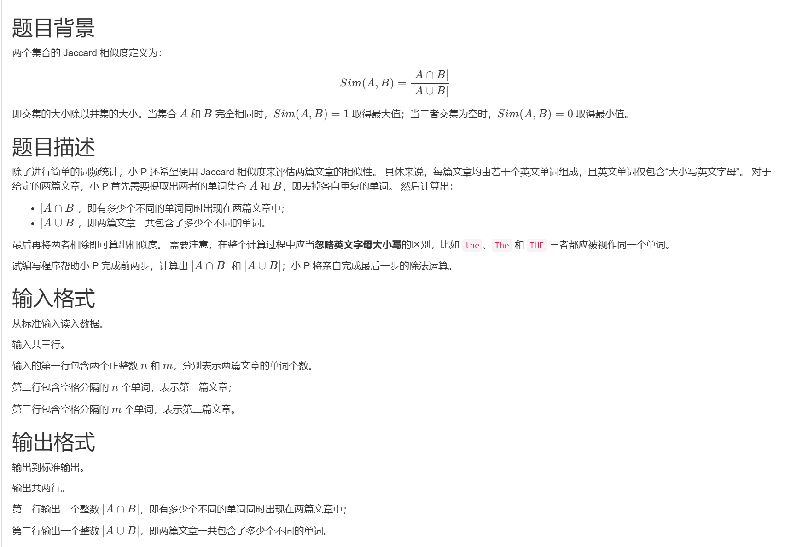

# 1167. 相似度计算（CSP 202403-2）

> 当前文件由 YOJ 原始题面快照的题面主体离线转换生成。公式尽量转换为 LaTeX，图片优先本地化为 Markdown 图片链接；下载失败时保留原始链接并记录 warning。
> 发布阶段、在线复验和提交形态等动态状态以 [data/problems.json](../../data/problems.json) 为准；本文件只保存题面内容和来源信息。

## 题目信息

- 原题地址：[http://yoj.ruc.edu.cn/index.php/index/problem/detail/pno/1167.html](http://yoj.ruc.edu.cn/index.php/index/problem/detail/pno/1167.html)
- 题目时间限制（题面）：1000 ms
- 题目内存限制（题面）：256MiB
- 归档语言：`c`
- 本次 AC 实际耗时（提交详情）：129 ms
- 本次 AC 实际内存占用（提交详情）：904 KB

---

【样例输入1】

3 2

The tHe thE

the THE

【样例输出1】

1

1

【样例输入2】

9 7

Par les soirs bleus dete jirai dans les sentiers

PICOTE PAR LES BLES FOULER LHERBE MENUE

【样例输出2】

2

13

【样例输入3】

15 15

Thou that art now the worlds fresh ornament And only herald to the gaudy spring

Shall I compare thee to a summers day Thou art more lovely and more temperate

【样例输出3】

4

24

【数据范围】

n,m<=10^4,每个单词最多包含10个字母。
