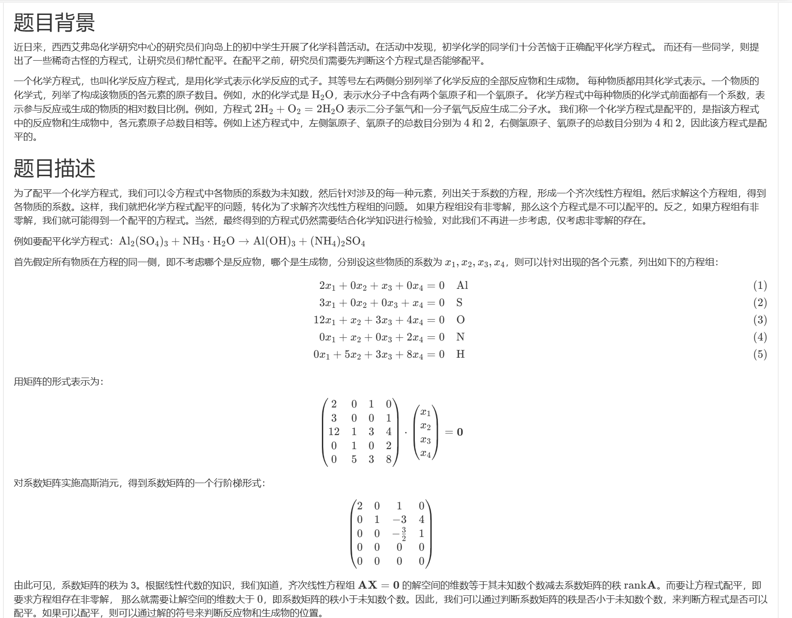
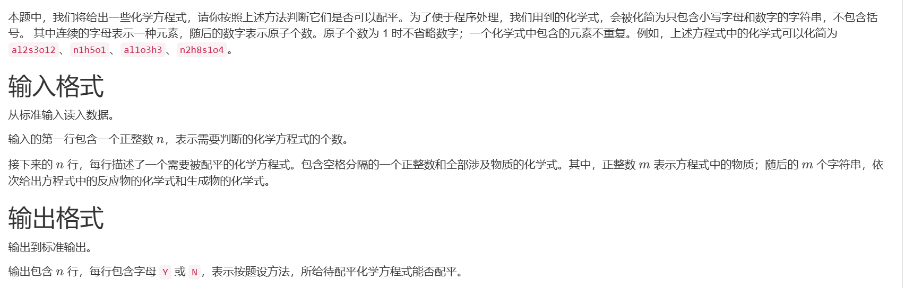
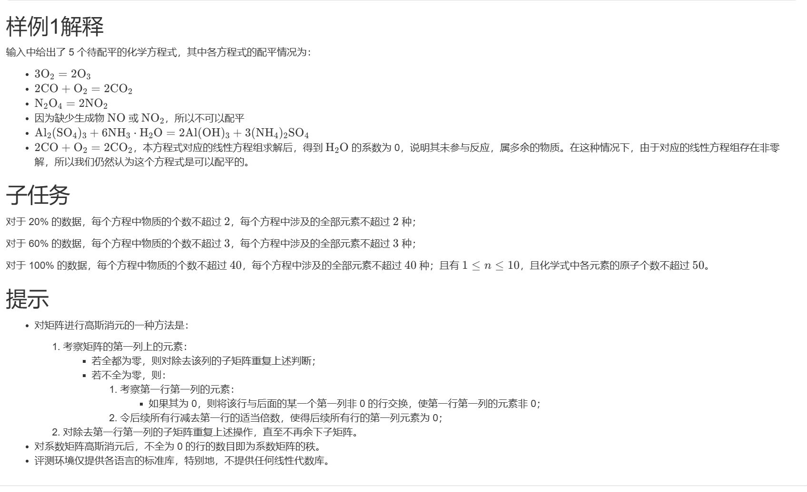

# 1168. 化学方程式配平（CSP 202403-3）

> 当前文件由 YOJ 原始题面快照的题面主体离线转换生成。公式尽量转换为 LaTeX，图片优先本地化为 Markdown 图片链接；下载失败时保留原始链接并记录 warning。
> 当前仓库阶段：`RAW_CAPTURED`。代码尚未完成脱敏清理、版本规范化、提交形态核验和在线复验。

## 题目信息

- 原题地址：[http://yoj.ruc.edu.cn/index.php/index/problem/detail/pno/1168.html](http://yoj.ruc.edu.cn/index.php/index/problem/detail/pno/1168.html)
- 题目时间限制（题面）：1000 ms
- 题目内存限制（题面）：256MiB
- 归档语言：`c`
- 本次 AC 实际耗时（提交详情）：37 ms
- 本次 AC 实际内存占用（提交详情）：504 KB

---

【样例输入】

6

2 o2 o3

3 c1o1 c1o2 o2

2 n2o4 n1o2

4 cu1 h1n1o3 cu1n2o6 h2o1

4 al2s3o12 n1h5o1 al1o3h3 n2h8s1o4

4 c1o1 c1o2 o2 h2o1

【样例输出】

Y

Y

Y

N

Y

Y

---

## 归档状态

- 题面转换：`CONVERTED_FROM_HTML_SNAPSHOT`
- 代码状态：`RAW_CAPTURED`（不可视为已清洗的公开题解）
- 在线 AC 复验：`NOT_RUN`
- 直接提交分块：`UNKNOWN_UNTIL_FORM_MAP`
