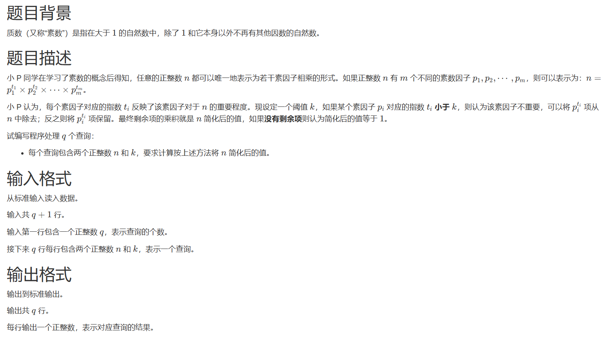
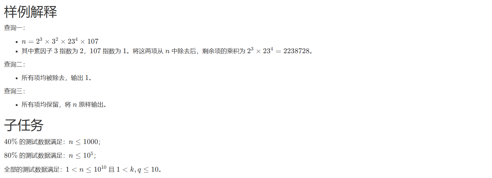

# 1199. 因子化简（CSP 202312-2）

> 当前文件由 YOJ 原始题面快照的题面主体离线转换生成。公式尽量转换为 LaTeX，图片优先本地化为 Markdown 图片链接；下载失败时保留原始链接并记录 warning。
> 发布阶段、在线复验和提交形态等动态状态以 [data/problems.json](../../data/problems.json) 为准；本文件只保存题面内容和来源信息。

## 题目信息

- 原题地址：[http://yoj.ruc.edu.cn/index.php/index/problem/detail/pno/1199.html](http://yoj.ruc.edu.cn/index.php/index/problem/detail/pno/1199.html)
- 题目时间限制（题面）：2000 ms
- 题目内存限制（题面）：512MiB
- 归档语言：`c`
- 本次 AC 实际耗时（提交详情）：93 ms
- 本次 AC 实际内存占用（提交详情）：632 KB

---

## 

## 样例输入

```
3
2155895064 3
2 2
10000000000 10
```

## 样例输出

```
2238728
1
10000000000
```


