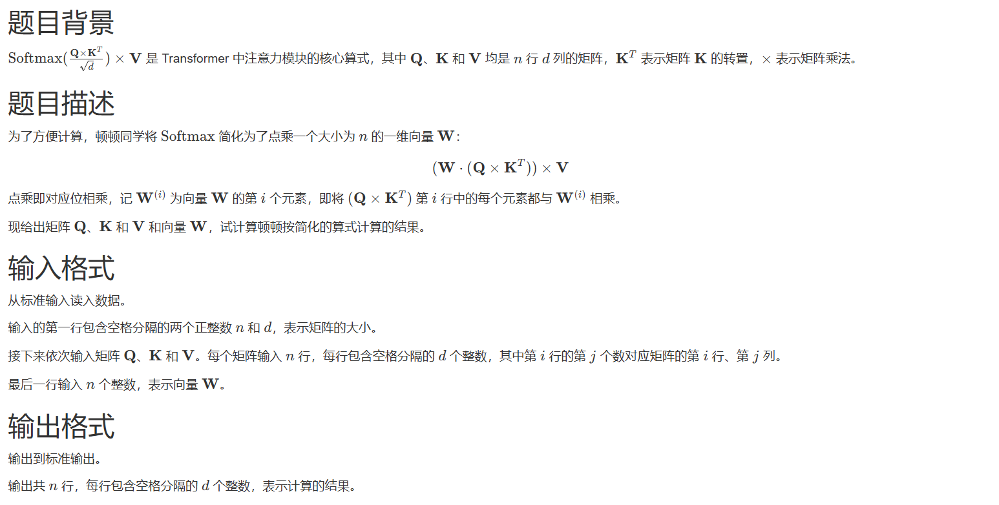
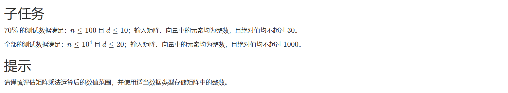

# 1204. # 1204 . 矩阵运算（CSP 202305-2）

> 当前文件由 YOJ 原始题面快照的题面主体离线转换生成。公式尽量转换为 LaTeX，图片优先本地化为 Markdown 图片链接；下载失败时保留原始链接并记录 warning。
> 当前版本已完成清洗、本地门禁、YOJ Accepted 复验和源码回收，可作为公开版本。

## 题目信息

- 原题地址：[http://yoj.ruc.edu.cn/index.php/index/problem/detail/pno/1204.html](http://yoj.ruc.edu.cn/index.php/index/problem/detail/pno/1204.html)
- 题目时间限制（题面）：5000 ms
- 题目内存限制（题面）：512MiB
- 归档语言：`c`
- 本次 AC 实际耗时（提交详情）：未记录
- 本次 AC 实际内存占用（提交详情）：未记录

---



## 样例输入

```
3 2
1 2
3 4
5 6
10 10
-20 -20
30 30
6 5
4 3
2 1
4 0 -5
```

## 样例输出

```
480 240
0 0
-2200 -1100
```



---

## 归档状态

- 题面转换：`CONVERTED_FROM_HTML_SNAPSHOT`
- 代码状态：`PUBLIC_READY`（清洗候选已通过发布门禁）
- 在线 AC 复验：`ONLINE_ACCEPTED`
- 直接提交分块：`VERIFIED`
