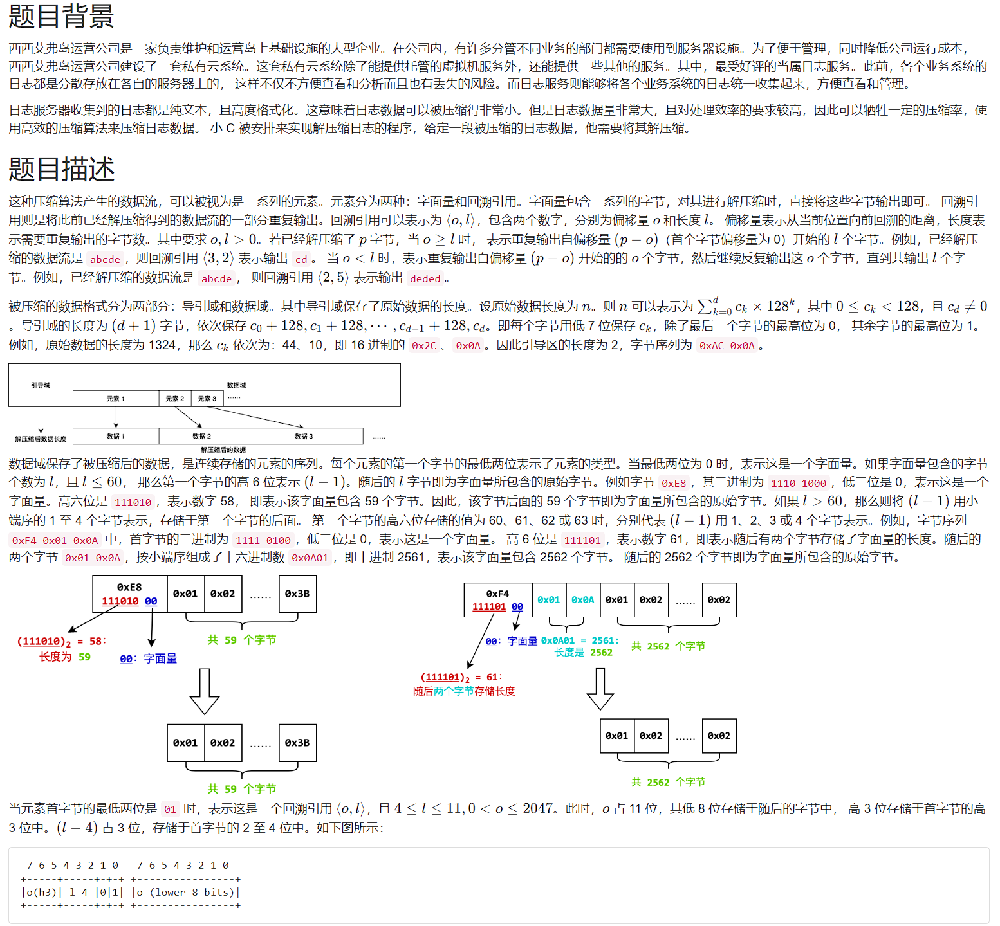
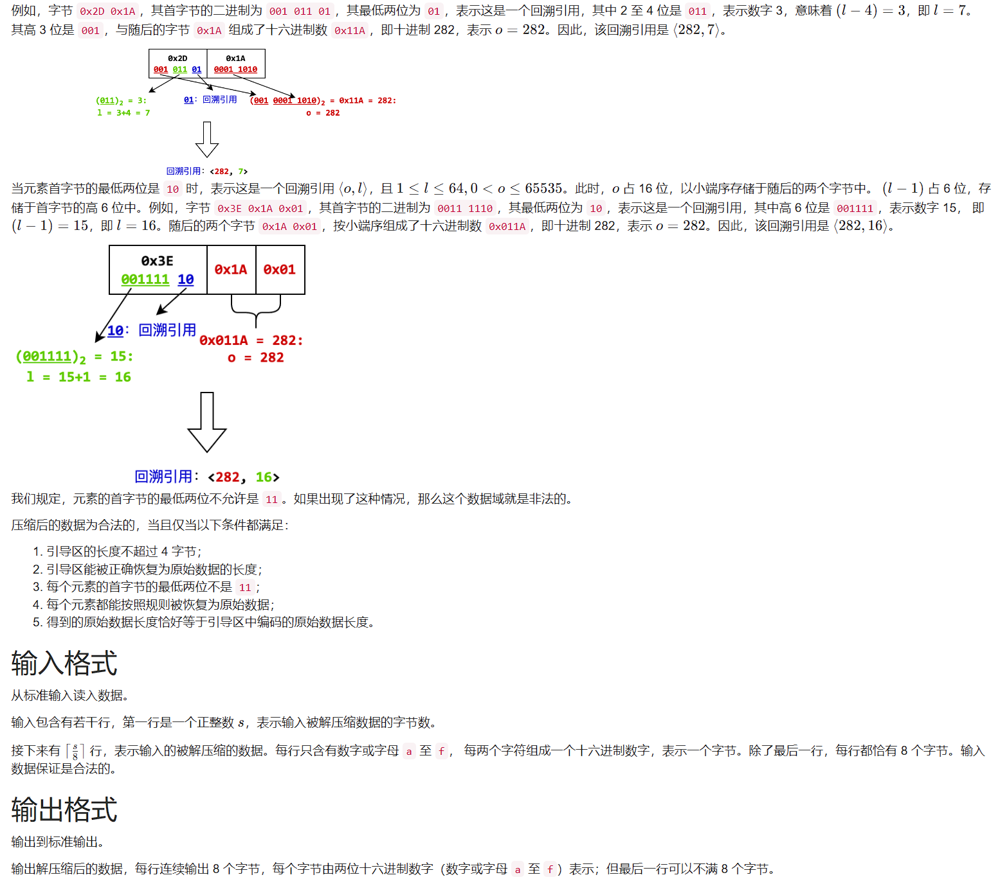
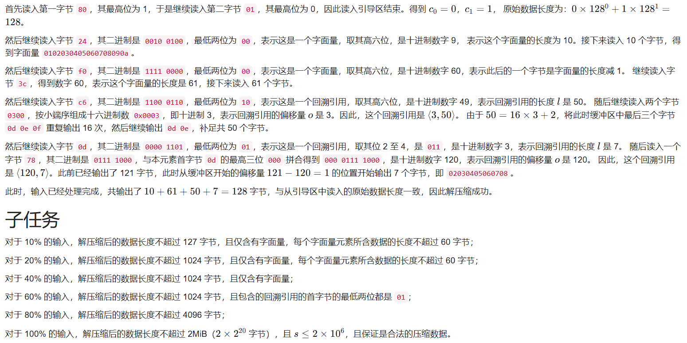

# 1205. # 1205 . 解压缩（CSP 202305-3）

> 当前文件由 YOJ 原始题面快照的题面主体离线转换生成。公式尽量转换为 LaTeX，图片优先本地化为 Markdown 图片链接；下载失败时保留原始链接并记录 warning。
> 当前版本已完成清洗、本地门禁、YOJ Accepted 复验和源码回收，可作为公开版本。

## 题目信息

- 原题地址：[http://yoj.ruc.edu.cn/index.php/index/problem/detail/pno/1205.html](http://yoj.ruc.edu.cn/index.php/index/problem/detail/pno/1205.html)
- 题目时间限制（题面）：5000 ms
- 题目内存限制（题面）：512MiB
- 归档语言：`c`
- 本次 AC 实际耗时（提交详情）：未记录
- 本次 AC 实际内存占用（提交详情）：未记录

---



## 样例1输入

```
81
8001240102030405
060708090af03c00
0102030405060708
090a0b0c0d0e0f01
0203040506070809
0a0b0c0d0e0f0102
030405060708090a
0b0c0d0e0f010203
0405060708090a0b
0c0d0e0fc603000d
78
```

## 样例1输出

```
0102030405060708
090a000102030405
060708090a0b0c0d
0e0f010203040506
0708090a0b0c0d0e
0f01020304050607
08090a0b0c0d0e0f
0102030405060708
090a0b0c0d0e0f0d
0e0f0d0e0f0d0e0f
0d0e0f0d0e0f0d0e
0f0d0e0f0d0e0f0d
0e0f0d0e0f0d0e0f
0d0e0f0d0e0f0d0e
0f0d0e0f0d0e0f0d
0e02030405060708
```

## 样例1解释

上述输入数据可以整理为：

```
80 01
24 0102030405060708090a
f0 3c
    000102030405060708090a0b0c0d0e0f
      0102030405060708090a0b0c0d0e0f
      0102030405060708090a0b0c0d0e0f
      0102030405060708090a0b0c0d0e0f
c6 0300
0d 78
```



---

## 归档状态

- 题面转换：`CONVERTED_FROM_HTML_SNAPSHOT`
- 代码状态：`PUBLIC_READY`（清洗候选已通过发布门禁）
- 在线 AC 复验：`ONLINE_ACCEPTED`
- 直接提交分块：`VERIFIED`
