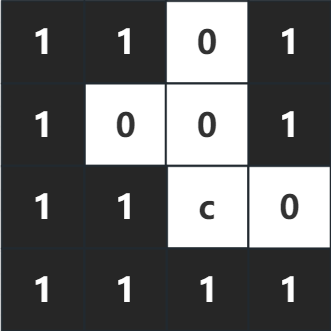
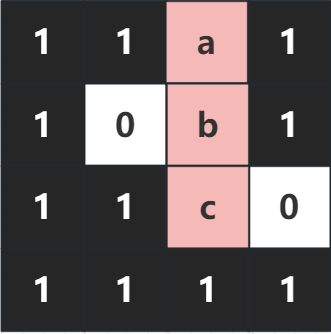
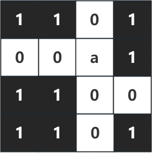
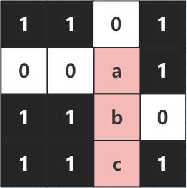
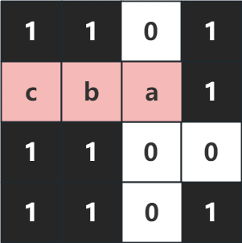
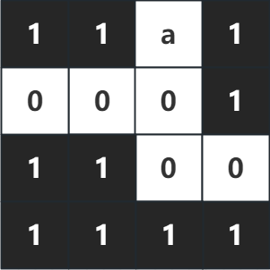
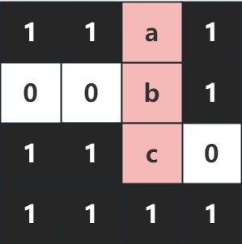
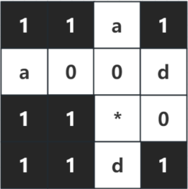
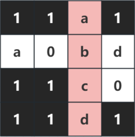

# 1215. 填字游戏Plus

> 当前文件由 YOJ 原始题面快照的题面主体离线转换生成。公式尽量转换为 LaTeX，图片优先本地化为 Markdown 图片链接；下载失败时保留原始链接并记录 warning。
> 当前仓库阶段：`RAW_CAPTURED`。代码尚未完成脱敏清理、版本规范化、提交形态核验和在线复验。

## 题目信息

- 原题地址：[http://yoj.ruc.edu.cn/index.php/index/problem/detail/pno/1215.html](http://yoj.ruc.edu.cn/index.php/index/problem/detail/pno/1215.html)
- 题目时间限制（题面）：1000 ms
- 题目内存限制（题面）：256MiB
- 归档语言：`cpp11`
- 本次 AC 实际耗时（提交详情）：681 ms
- 本次 AC 实际内存占用（提交详情）：3372 KB

---

【题目描述】

填字游戏玩法很简单，给定一个**m****行n****列**的棋盘board，这表示一个填字游戏**当前的状态**。棋盘上有四种类型的格子：

l 0表示**空格子**；

l 1 表示**障碍格子**；

l 小写英文字母表示已经填入了**字母的格子**；

l *表示已经填入了**任意字母的格****子**。

现在给你一个字符串word，如果满足以下条件，我们就认为word可以被填入到board中：

1. word可以**水平放置**（从左到右或从右到左），也可以**竖直放置**（从上到下或从下到上）；

2. word的字母**不能**够填入到障碍格子中；

3. word的每个字母要么填入到**空格子**中，要么填入到与board里**已有字符匹配的格子**中；如果board里对应的已填入的字符是*，那么它可以和**任意的字母匹配**；

4. 若word是**水平放置**，且放置之后word的**最左边**和**最右边**有相邻的格子，那么这个格子**必须**是一个**障碍格子**；

5. 若word是**竖直放置**，且放置之后word的**最上边**和**最下边**有相邻的格子，那么这个格子**必须**是一个**障碍格子**；

6. 如果一个word在board中有多个可以填入的位置，则优先选择填入后棋盘board上**留下空格数量最多**的填入方式；

7. 如果一个word在board的相同格子的水平方向（竖直方向）上存在从左到右和从右到左（从上到下和从下到上）都合法的填入方式，优先选择从左到右（从上到下）的填入方式

如果word可以填入到board中，则打印出word第一个和最后一个字母在board中的坐标；如果不能填入到board则打印 No。

【输入格式】

第一行是两个正整数，分别代表m和n；

接下来的m行是棋盘board的当前状态，字符间用空格隔开；

最后一行是要填入的单词word。

【输出格式】

如果word可以填入到board中，则第一行输出word第一个字母在board中的行和列，中间用空格隔开；第二行输出word最后一个字母在board中的行和列，中间用空格隔开。

如果不能填入board则输出 No。

【数据范围】

0 < m , n <= 2000 ，word长度不超过2000，且word所有字符均为小写字母。

【特殊说明】

题目保证棋盘board上有且仅有一种最优的填入方式。

【输入样例1】

4 4

1 1 0 1

1 0 0 1

1 1 c 0

1 1 1 1

abc

【输出样例1】

0 2

2 2

【样例解释1】

 

（左图表示棋盘当前状态，右图表示填入单词之后棋盘的状态）

我们要输入的单词是abc，观察board，单词的第1个字母a和第2个字母b可以填入到board的(0,2)和(1,2)两个空格子中，单词的最后一个字母c与board的(2,2)处已经填入的字母c相匹配，根据**规则****3**可以填入，且该位置是word可以填入的唯一位置。所以，我们需要输出word填入后的第一个字母填入的位置0 2（代表第0行第2列）和最后一个字母填入的位置2 2（代表第2行第2列）。

【输入样例2】

4 4

1 1 0 1

0 0 a 1

1 1 0 0

1 1 0 1

abc

【输出样例2】

1 2

1 0

【样例解释2】

  

这个例子中，棋盘board的当前状态如上面左图所示，如果像上面中图一样，将单词abc填入(1,2)到(3,2)的格子里，那么单词的最上边相邻的格子是一个空格子（word的最上边对应的是第1行第2列填入了a的格子，与之相邻的格子是第0行第2列的空格子），不是障碍格子，根据**规则****5**，这是不合法的。所以我们只能像上面右图一样，将单词abc填入(1,2)到(1,0)的格子中。

【输入样例3】

4 4

1 1 a 1

0 0 0 1

1 1 0 0

1 1 1 1

abc

【输出样例3】

0 2

2 2

【样例解释3】

 

该例子中，我们能很自然地想到三种填入的方法。第一种是填入(0,2)到(2,2)的格子中，第二种是填入(1,0)到(1,2)格子中，第三种是填入到(1,2)到(1,0)格子中。其中，第二种和第三种填入方式都是占用了(1,0)到(1,2)这三个格子，只不过第二种填入方式是从左到右，第三种填入方式是从右到左，根据**规则****7**，我们会优先选择第二种填入方式。但这题中，第二种和第三种填入方式填入之后，棋盘中空格子的个数为2，而第一种填入方式填入之后，棋盘中空格子的个数为3，根据**规则****6**，我们优先采用填入之后剩余空格子数量最多的填入方式，所以最后我们采用**第一种**填入方式，将单词填入(0,2)到(2,2)的格子。

【输入样例4】

4 4

1 1 a 1

a 0 0 d

1 1 * 0

1 1 d 1

abcd

【输出样例4】

0 2

3 2

【样例解释4】

 

这个例子，我们可以很自然地想到两种填入方式，第一种方式是填入(1,0)到(1,3)，因为根据**规则****3****，**单词的第1个字母a、第4个字母d和board的(1,0), (1,3)处的字母匹配，单词中间的两个字母b和c可以填入到(1,1)、(1,2)两个空格子中；第二种填入(0,2)到(3,2)，因为根据**规则****3**，单词的第1个字母a、第4个字母d和board的(0,2), (3,2)处的字母匹配，单词的第2个字母b可以填入到(1,2)这个空格子中，单词的第3个字母c和board的(2,2)处的*是匹配的，故可以填入(0,2)到(3,2)格子中。

如果使用第一种方式填入，最后棋盘board中剩下1个空格子，而使用第二种方法填入的话，board中会剩下2个空格子。根据**规则****6**，为了使填入后剩余的空格子数量最多，我们优先使用第2种填入方法。

---

## 归档状态

- 题面转换：`CONVERTED_FROM_HTML_SNAPSHOT`
- 代码状态：`RAW_CAPTURED`（不可视为已清洗的公开题解）
- 在线 AC 复验：`NOT_RUN`
- 直接提交分块：`UNKNOWN_UNTIL_FORM_MAP`
