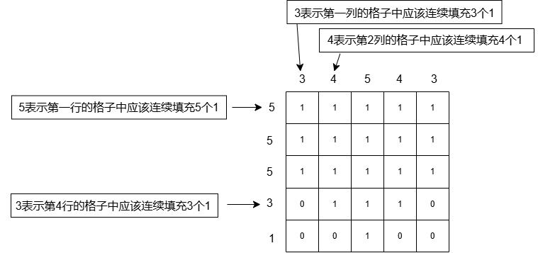

# 1287. # 1287 . 数独趣味格子

> 当前文件由 YOJ 原始题面快照的题面主体离线转换生成。公式尽量转换为 LaTeX，图片优先本地化为 Markdown 图片链接；下载失败时保留原始链接并记录 warning。
> 当前版本已完成清洗、本地门禁、YOJ Accepted 复验和源码回收，可作为公开版本。

## 题目信息

- 原题地址：[http://yoj.ruc.edu.cn/index.php/index/problem/detail/pno/1287.html](http://yoj.ruc.edu.cn/index.php/index/problem/detail/pno/1287.html)
- 题目时间限制（题面）：1000 ms
- 题目内存限制（题面）：256MiB
- 归档语言：`c`
- 本次 AC 实际耗时（提交详情）：未记录
- 本次 AC 实际内存占用（提交详情）：未记录

---

【问题描述】

游戏中给定一个有n行n列的方形棋盘，该棋盘的每一行/列都会被一个非零正整数指定填充规则。例如，第i行会有一个整数r_{i}定义了该行格子需要连续填充r_{i}个整数1；同理，第j列会有一个整数c_{j}定义该列需要连续填充c_{j}个1；没有被1填充的格子用0来填充。玩家需要使用0和1对这个棋盘进行填充，使这个棋盘能够同时满足所有的行/列规则，请编程实现。

【输入格式】

第一行，包含一个整数n，代表棋盘的行列数。

第二行，包含n个整数，代表棋盘每一行的填充规则。

第三行，包含n个整数，代表棋盘每一列的填充规则。

【输出格式】

n行n列个整数（1或0），来表示棋盘的正确填充结果。

【数据说明】

l 题目数据保证棋盘的填充方式有且只有唯一解；

l 对于所有数据，1 <= n <= 11。

| 【输入样例】55 5 5 3 13 4 5 4 3 | 【输出样例】1 1 1 1 11 1 1 1 11 1 1 1 10 1 1 1 00 0 1 0 0 |
| --- | --- |

【样例解释】

---

## 归档状态

- 题面转换：`CONVERTED_FROM_HTML_SNAPSHOT`
- 代码状态：`PUBLIC_READY`（清洗候选已通过发布门禁）
- 在线 AC 复验：`ONLINE_ACCEPTED`
- 直接提交分块：`VERIFIED`
