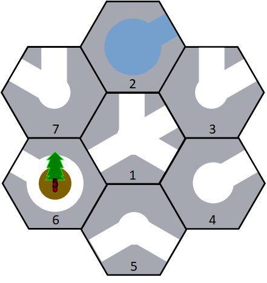
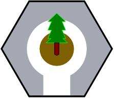
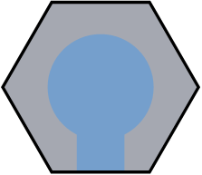
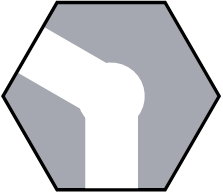
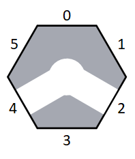
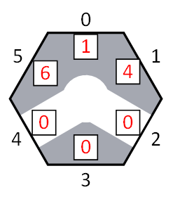
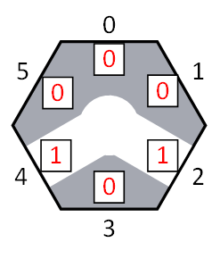
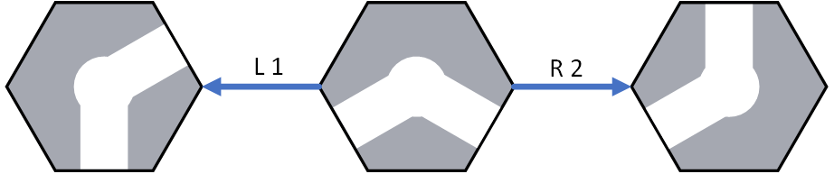
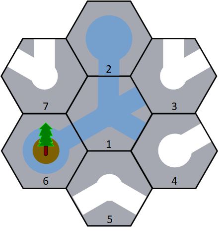

# 1288. 六边形绿洲

> 当前文件由 YOJ 原始题面快照的题面主体离线转换生成。公式尽量转换为 LaTeX，图片优先本地化为 Markdown 图片链接；下载失败时保留原始链接并记录 warning。
> 当前版本已完成清洗、本地门禁、YOJ Accepted 复验和源码回收，可作为公开版本。

## 题目信息

- 原题地址：[http://yoj.ruc.edu.cn/index.php/index/problem/detail/pno/1288.html](http://yoj.ruc.edu.cn/index.php/index/problem/detail/pno/1288.html)
- 题目时间限制（题面）：1000 ms
- 题目内存限制（题面）：256MiB
- 归档语言：`cpp17`
- 本次 AC 实际耗时（提交详情）：239 ms
- 本次 AC 实际内存占用（提交详情）：1512 KB

---

【问题描述】

在一个遥远的奇幻世界中，有一个被称为“六边形绿洲”的神秘之地。你是一位被召唤到六边形绿洲的智者，你的任务是设计一个灌溉方案，确保清澈的泉水能够顺利流经水渠，最终到达生命之树，滋养它的根须。在你的棋盘上，有三种类型的格子：水源、水渠、以及生命之树。你的挑战是，通过旋转格子，使得水流能够从水源经过水渠，最终流向生命之树。在你大展身手之前，请先通过新手教程：

你会得到一个这样的地图，记为Map，图中的每一个格子都是六边形的，每一个格子也都有自己独一无二的编号，格子内部会有水渠，但不同格子水渠数量和排布方式可能不同。

地图中有三种不同类型的格子，下图从左到右分别是：生命之树格子、水源格子和水渠格子。其中生命之树格子和水源格子只有1条水渠，水渠格子可能会有0-6条水渠，图中展示的水渠格子有2条水渠。

  

每一个格子都有6个边界，从最上面的开始，我们顺时针依次将6个边界编号为0到5

每一个格子可能会有若干个邻居，以Map中的编号为5的格子为例。该格子有三个邻居，编号分别是4,1,6。所以我们会用数组neighbor = [1,4,0,0,0,6]来描述该格子的邻居，其中neighbor[0]为1，它表示该格子5的第0个边界与格子1相连；neighbor[1]为4，它表示格子3的第1个边界与格子4相连；neighbor[2]为0，它表示格子3的第2个边界没有相邻的邻居格子，依此类推。

每一个格子中会有若干条水渠，水渠通向的方向和数量由数组connect描述。以Map中的编号为5的格子为例，我们可以用数组connect = [0,0,1,0,1,0]描述该格子内部水渠的排布情况，其中connect[0]为0，它表示该格子第0条边没有水渠与之相连；connect[2]为1，它表示该格子第2条边有水渠与之相连，依此类推。

你能够对图上任意一个格子在顺时针（R）或逆时针（L）方向上进行若干次旋转，让水流从水源流向生命之树。下图展示了Map中格子5的旋转过程。中间的格子是未旋转的格子，左边的是中间的格子逆时针旋转1次后得到的结果（L 1）；右边的格子是中间的格子顺时针旋转2次后得到的结果（R 2）。你顺时针或逆时针旋转的次数只能是一个正整数，大小没有限制，但是同一个方向旋转超过6次是浪费资源且没有意义的，所以尽量将你顺时针或逆时针旋转的次数控制在6次以内。

值得注意的是，灌溉的方案不是唯一的，最终你得出的方案将被送到这个世界的长老们那儿，由他们审核验证。

| 【输入样例】71 2 3 4 5 6 7 1 1 1 0 1 0 0 0 0 3 1 7 0 0 1 0 0 0 0 1 0 0 0 4 1 2 1 1 0 0 0 0 1 3 0 0 0 5 1 0 1 0 0 0 0 1 1 4 0 0 0 6 0 0 1 0 1 0 2 7 1 5 0 0 0 0 0 0 0 0 1 1 0 2 1 6 0 0 1 0 0 0 0 1 | 【输出样例】22 R 26 R 2 |
| --- | --- |

【输入格式】

第一行是一个整数n，表示地图中的格子数；

接下来3n行将会描述格子的属性，每3行能够描述一个格子的属性。其中：

l 第１行是１个整数，表示格子的类型（水源：0，水渠：1，生命之树：2）；

l 第2行是6个整数，中间用空格分开，表示格子的邻居格子情况，即neighbor数组；

l 第3行是6个整数，中间用空格分开，表示格子的内部水渠排布情况，即connect数组。

【输出格式】

第1行是一个整数m，表示你提出的灌溉方案需要进行的旋转操作的数量；

接下来m行是具体的旋转操作，每一个旋转操作由1个整数、1个字符、1个整数组成，中间用空格分隔。其中：

l 第1个整数表示要旋转的格子id；

l 第2个字符表示旋转方向，有且仅有R和L两种旋转方向。R表示顺时针旋转，L表示逆时针旋转；

l 第3个整数表示旋转次数，只能是大于等于0的正整数。

【数据说明】

l 对于80%的数据，n <= 100；

l 对于100%的数据，n <= 2000。

【注意事项】

l 题目所给数据的格子下标id从1开始；换句话说，题目输入中的第1个格子属性（第2-4行）是id为1的格子的描述信息，输入中的第2个格子属性（第5-7行）是id为2的格子的描述信息，依此类推；

l 题目保证一定有解，但不保证存在唯一解，只要输出**任意**正确灌溉方案即可；

l 题目中的格子顺时针或逆时针旋转的次数只能是一个正整数，大小没有限制，但是同一个方向旋转超过6次是浪费资源且没有意义的，所以尽量将你顺时针或逆时针旋转的次数控制在6次以内；

l 对于最后20%的n大小超过100的数据点，可以考虑如何优先选择更靠近目标的格子进行探索。

【样例解释】

 

根据题目所给输入，地图有7个格子，可以构建如上左边的图。我们可以将第2个格子顺时针旋转2次，第6个格子顺时针旋转2次，便可让水源和生命之树连通。整个过程我们需要进行2次旋转操作，因此输出的m数为2，接着输出了“2 R 2”表示第2个格子顺时针旋转2次；“6 R 2”表示第6个格子顺时针旋转2次。

---

## 归档状态

- 题面转换：`CONVERTED_FROM_HTML_SNAPSHOT`
- 代码状态：`PUBLIC_READY`（清洗候选已通过发布门禁）
- 在线 AC 复验：`ONLINE_ACCEPTED`
- 直接提交分块：`VERIFIED`
