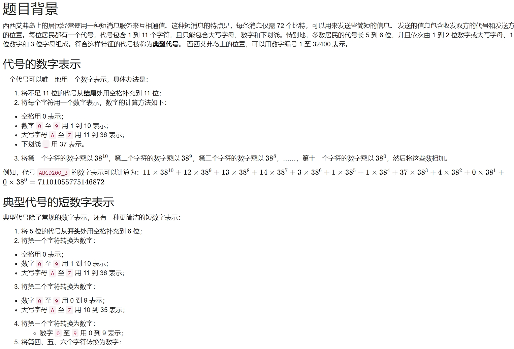
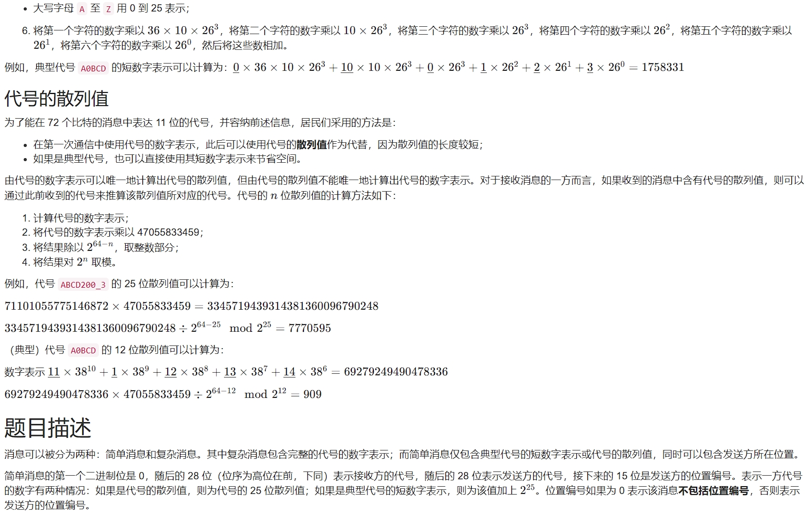
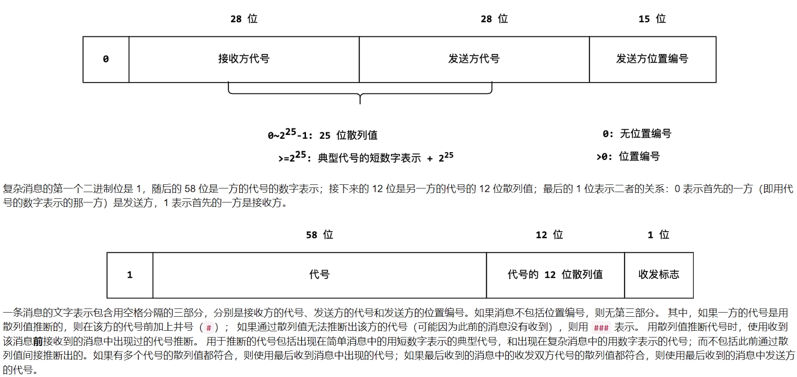
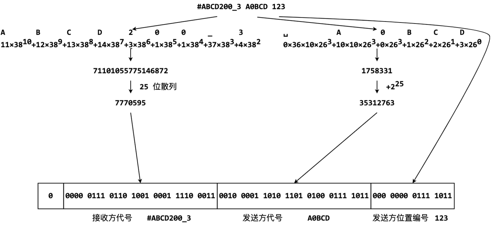
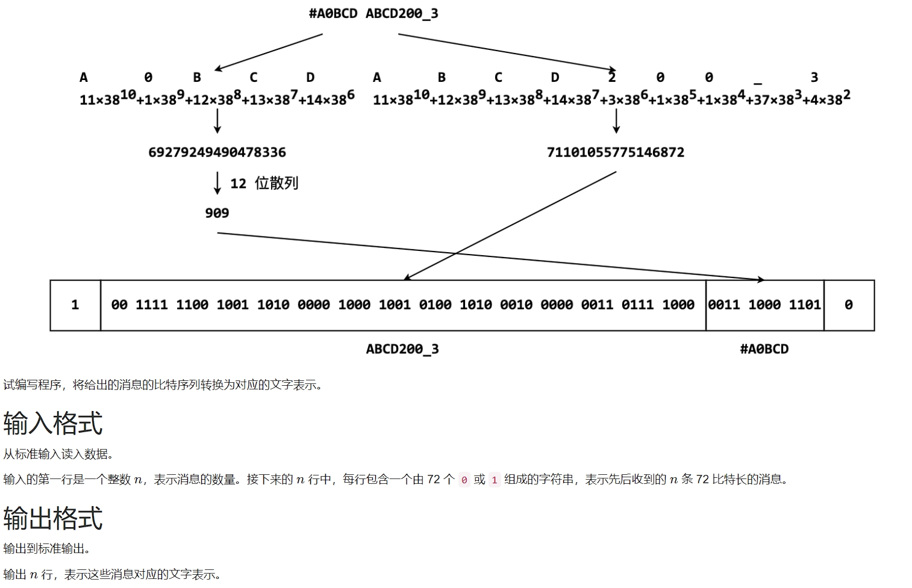
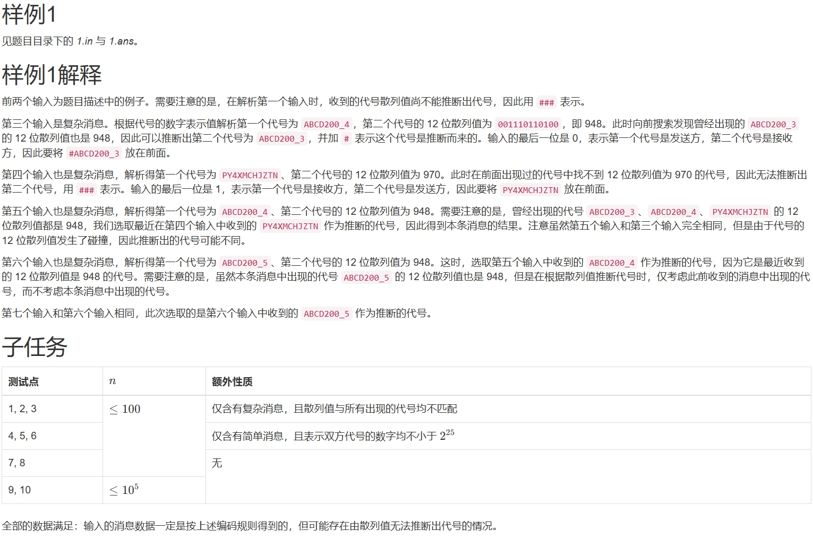

# 1414. # 1414 . 消息解码（CSP 202506-3）

> 当前文件由 YOJ 原始题面快照的题面主体离线转换生成。公式尽量转换为 LaTeX，图片优先本地化为 Markdown 图片链接；下载失败时保留原始链接并记录 warning。
> 当前版本已完成清洗、本地门禁、YOJ Accepted 复验和源码回收，可作为公开版本。

## 题目信息

- 原题地址：[http://yoj.ruc.edu.cn/index.php/index/problem/detail/pno/1414.html](http://yoj.ruc.edu.cn/index.php/index/problem/detail/pno/1414.html)
- 题目时间限制（题面）：2000 ms
- 题目内存限制（题面）：256MiB
- 归档语言：`cpp17`
- 本次 AC 实际耗时（提交详情）：未记录
- 本次 AC 实际内存占用（提交详情）：未记录

---









# 样例一

## 输入

```
7
100111111001001101000001000100101001010001000000011011110000011100011010
000000111011010010001111000110010000110101101010001111011000000001111011
100111111001001101000001000100101001010001000001001000111000011101101000
110010110001000111010011000010110001101000100110000001111000011110010101
100111111001001101000001000100101001010001000001001000111000011101101000
100111111001001101000001000100101001010001000001110110000000011101101000
100111111001001101000001000100101001010001000001110110000000011101101000
```

## 输出

```
### ABCD200_3
#ABCD200_3 A0BCD 123
#ABCD200_3 ABCD200_4
PY4XMCHJZTN ###
#PY4XMCHJZTN ABCD200_4
#ABCD200_4 ABCD200_5
#ABCD200_5 ABCD200_5
```



---

## 归档状态

- 题面转换：`CONVERTED_FROM_HTML_SNAPSHOT`
- 代码状态：`PUBLIC_READY`（清洗候选已通过发布门禁）
- 在线 AC 复验：`ONLINE_ACCEPTED`
- 直接提交分块：`VERIFIED`
