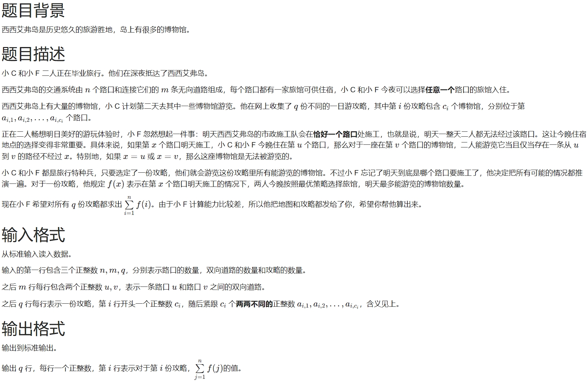
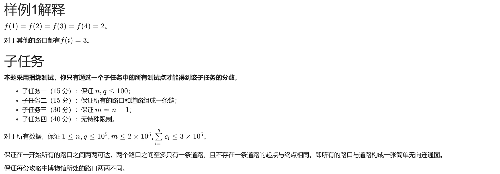

# 1416. 博物馆（CSP 202506-5）

> 当前文件由 YOJ 原始题面快照的题面主体离线转换生成。公式尽量转换为 LaTeX，图片优先本地化为 Markdown 图片链接；下载失败时保留原始链接并记录 warning。
> 当前仓库阶段：`RAW_CAPTURED`。代码尚未完成脱敏清理、版本规范化、提交形态核验和在线复验。

## 题目信息

- 原题地址：[http://yoj.ruc.edu.cn/index.php/index/problem/detail/pno/1416.html](http://yoj.ruc.edu.cn/index.php/index/problem/detail/pno/1416.html)
- 题目时间限制（题面）：2000 ms
- 题目内存限制（题面）：256MiB
- 归档语言：`cpp17`
- 本次 AC 实际耗时（提交详情）：5521 ms
- 本次 AC 实际内存占用（提交详情）：46680 KB

---



# 样例一

## 输入

```
7 9 1
1 2
1 3
2 3
1 4
1 5
4 5
1 6
1 7
6 7
3 2 3 4
```

## 输出

```
17
```



---

## 归档状态

- 题面转换：`CONVERTED_FROM_HTML_SNAPSHOT`
- 代码状态：`RAW_CAPTURED`（不可视为已清洗的公开题解）
- 在线 AC 复验：`NOT_RUN`
- 直接提交分块：`UNKNOWN_UNTIL_FORM_MAP`
