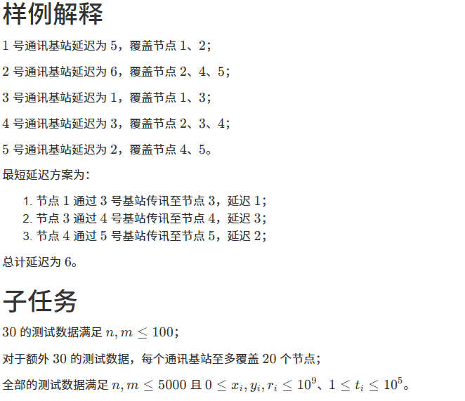

# 1424. 通讯延迟（CSP 202409-4）

> 当前文件由 YOJ 原始题面快照的题面主体离线转换生成。公式尽量转换为 LaTeX，图片优先本地化为 Markdown 图片链接；下载失败时保留原始链接并记录 warning。
> 当前版本已完成清洗、本地门禁、YOJ Accepted 复验和源码回收，可作为公开版本。

## 题目信息

- 原题地址：[http://yoj.ruc.edu.cn/index.php/index/problem/detail/pno/1424.html](http://yoj.ruc.edu.cn/index.php/index/problem/detail/pno/1424.html)
- 题目时间限制（题面）：1500 ms
- 题目内存限制（题面）：512MiB
- 归档语言：`c`
- 本次 AC 实际耗时（提交详情）：470 ms
- 本次 AC 实际内存占用（提交详情）：784 KB

---

## 题目描述

给定二维平面上 \(n\) 个节点，以及 \(m\) 个通讯基站。第 \(i\) 个基站可以覆盖以坐标 \((x_{i},y_{i})\) 为中心、\(2r_{i}\) 为边长的正方形区域，并使正方形区域内（包含边界）所有节点以 \(t_{i}\) 单位时间的延迟进行相互通讯。

求节点 \(1\) 到 \(n\) 的最短通讯延迟。

## 输入格式

从标准输入读入数据。

第一行包含空格分隔的两个正整数 \(n\)、\(m\)；

接下来 \(n\) 行，每行两个整数 \(x_{i},y_{i}\)，代表第 \(i\) 个节点的坐标；

接下来 \(m\) 行，每行四个整数 \(x_{j},y_{j},r_{j},t_{j}\)，代表第 \(j\) 个通讯基站的坐标，通讯半径与通讯延迟。

## 输出格式

输出到标准输出。

输出一行，即节点 \(1\) 到 \(n\) 的最短通讯延迟；如果无法通讯，则输出 `Nan`。

## 样例输入

```
5 5
0 0
2 4
4 0
5 3
5 5
1 2 2 5
3 5 2 6
2 0 2 1
4 2 2 3
5 4 1 2
```

## 样例输出

```
6
```



---

## 归档状态

- 题面转换：`CONVERTED_FROM_HTML_SNAPSHOT`
- 代码状态：`PUBLIC_READY`（清洗候选已通过发布门禁）
- 在线 AC 复验：`ONLINE_ACCEPTED`
- 直接提交分块：`VERIFIED`
