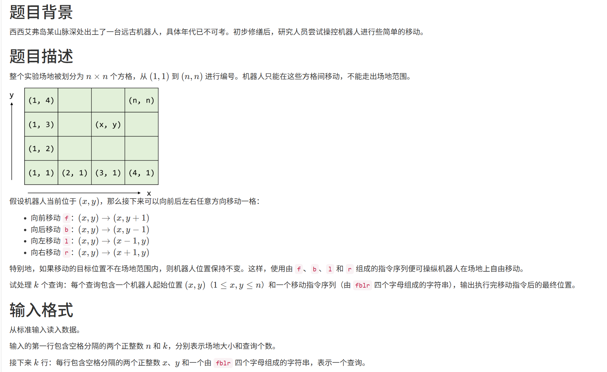
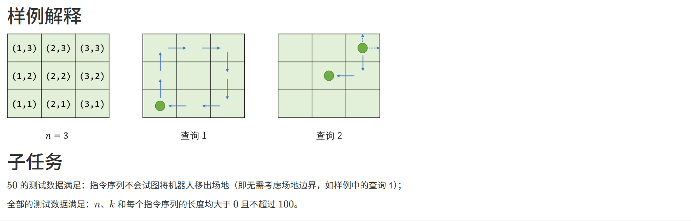

# 1431. # 1431 . 移动 (CSP 202412-1)

> 当前文件由 YOJ 原始题面快照的题面主体离线转换生成。公式尽量转换为 LaTeX，图片优先本地化为 Markdown 图片链接；下载失败时保留原始链接并记录 warning。
> 当前版本已完成清洗、本地门禁、YOJ Accepted 复验和源码回收，可作为公开版本。

## 题目信息

- 原题地址：[http://yoj.ruc.edu.cn/index.php/index/problem/detail/pno/1431.html](http://yoj.ruc.edu.cn/index.php/index/problem/detail/pno/1431.html)
- 题目时间限制（题面）：1000 ms
- 题目内存限制（题面）：512MiB
- 归档语言：`cpp17`
- 本次 AC 实际耗时（提交详情）：未记录
- 本次 AC 实际内存占用（提交详情）：未记录

---



# 样例一

## 输入

```
3 2
1 1 ffrrbbll
3 3 frbl
```

## 输出

```
1 1
2 2
```



---

## 归档状态

- 题面转换：`CONVERTED_FROM_HTML_SNAPSHOT`
- 代码状态：`PUBLIC_READY`（清洗候选已通过发布门禁）
- 在线 AC 复验：`ONLINE_ACCEPTED`
- 直接提交分块：`VERIFIED`
