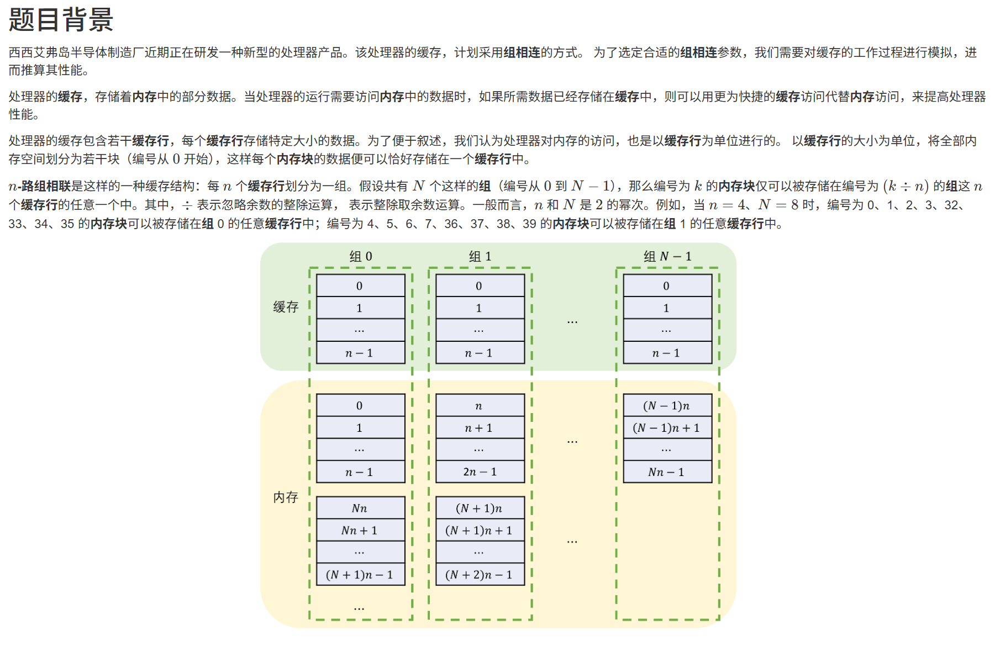

# 1434. # 1434 . 缓存模拟 (CSP 202412-3)

> 当前文件由 YOJ 原始题面快照的题面主体离线转换生成。公式尽量转换为 LaTeX，图片优先本地化为 Markdown 图片链接；下载失败时保留原始链接并记录 warning。
> 当前版本已完成清洗、本地门禁、YOJ Accepted 复验和源码回收，可作为公开版本。

## 题目信息

- 原题地址：[http://yoj.ruc.edu.cn/index.php/index/problem/detail/pno/1434.html](http://yoj.ruc.edu.cn/index.php/index/problem/detail/pno/1434.html)
- 题目时间限制（题面）：1000 ms
- 题目内存限制（题面）：512MiB
- 归档语言：`cpp17`
- 本次 AC 实际耗时（提交详情）：未记录
- 本次 AC 实际内存占用（提交详情）：未记录

---



## 题目描述

具体而言，给定要读取或写入的内存块编号，即可确定该内存块可能位于的缓存行组的编号。此时，可能存在的情况有两种：

- 该缓存行组的某个缓存行已经存储了该内存块的数据，即命中；
- 该缓存行组的所有缓存行都没有存储该内存块的数据，即未命中。

当发生命中时，处理器可以直接使用或修改该缓存行中的数据，而不需要实际读写内存。 当发生未命中时，处理器需要从内存中读取数据，并将其存储到该缓存行组中的一个缓存行中，然后再使用或修改该缓存行中的数据。这个将内存中的数据读入到缓存的过程称为载入。

当执行载入操作时，如果该缓存行组中有尚未存储数据的缓存行，那么将数据存储到其中一个尚未存储数据的缓存行中，并在缓存行中记录所存储的数据块的编号；否则，按照一定方法，选择该组中的一个缓存行，并将数据存储到其中，这一过程称为替换。

当发生替换时，需要考虑被替换的缓存行是否发生过修改，即执行过写操作。如果发生过修改，则需要先将缓存行中的数据写入内存中的对应位置；然后忽略该缓存行中的数据、将新读入的数据存入其中，并记录所存储数据块的编号。

在一个缓存行组中选择被替换的缓存行的方法有很多种，该种处理器采用的是最近最少使用（LRU）方法。该方法将一个缓存行组中存有数据的缓存行排成一队，每次读或写一个缓存行时，都将该缓存行移动到队列的最前端。当需要替换缓存行时，选择队列的最后一个缓存行（最久没被读写）进行替换。

本题目中，将给出一系列的处理器运行时遇到的对内存的读写指令，并假定初始时处理器的缓存为空。你需要根据上文描述的缓存工作过程，给出处理器对内存的实际读写操作序列。

## 输入格式

从标准输入读入数据。

输入的第一行包含空格分隔的三个整数 n,N,qn,N,q，分别表示组相联的路数 nn 和组数 NN，以及要处理的读写指令的数量 qq。

接下来 qq 行，每行包含空格分隔的两个整数 oo 和 aa。其中，oo 表示读写指令的类型，aa 表示要读写的内存块的编号。oo 为 00 或 11，分别表示读和写操作。

## 输出格式

输出到标准输出。

输出若干行，每行包含空格分隔的两个整数 o′o′ 和 a′a′，表示实际处理器对内存的读写操作。o′o′ 为 00 或 11，分别表示读和写操作；a′a′ 表示要读写的内存块的编号。

## 样例输入

```
4 8 8
0 0
0 1
1 2
0 1
1 0
0 32
1 33
0 34
```

## 样例输出

```
0 0
0 1
0 2
0 32
1 2
0 33
0 34
```

## 样例解释

该处理器的缓存为 4 路组相联，共有 8 组。初始时，处理器的缓存为空。共需要处理 8 条指令：

- 第 1 条指令为读取内存块 0，未命中，要实际读取内存块 0，并存储到组 0 的一个缓存行；
- 第 2 条指令为读取内存块 1，未命中，要实际读取内存块 1，并存储到组 0 的另一个缓存行；
- 第 3 条指令为写入内存块 2，未命中，要实际读取内存块 2，并存储到组 0 的第三个缓存行，然后根据指令在缓存中对其进行修改；
- 第 4 条指令为读取内存块 1，命中，直接从缓存中调取数据；
- 第 5 条指令为写入内存块 0，命中，直接修改缓存中的数据；
- 第 6 条指令为读取内存块 32，未命中，要实际读取内存块 32，并存储到组 0 的第四个缓存行；
- 第 7 条指令为写入内存块 33，未命中，此时组 0 中的 4 个缓存行都保存了数据：最近使用的是保存有内存块 32 的缓存行，其次是保存有内存块 0 的缓存行，然后是 1，最后是 2，因此选择替换保存有内存块 2 的缓存行。注意到该缓存行在执行第 3 条指令时被修改过，因此需要先将其写入内存，然后再读取内存块 33 的数据存储到该缓存行中；
- 第 8 条指令为读取内存块 34，未命中，此时组 0 中的 4 个缓存行都保存了数据，按照同样的办法，选择保存有内存块 1 的缓存行替换。注意到该缓存行未被修改过，因此可以直接读取内存块 34 的数据存储到该缓存行中。

## 子任务

对于 20% 的数据，有 n=1,N=1n=1,N=1；

对于 40% 的数据，有 n=1n=1；

另外 20% 的数据，有 N=1,q≤nN=1,q≤n；

对于 100% 的数据，有 1≤n,N,n×N≤655361≤n,N,n×N≤65536，且 n,Nn,N 为 2 的幂次；1≤q≤1051≤q≤105，<math x

---

## 归档状态

- 题面转换：`CONVERTED_FROM_HTML_SNAPSHOT`
- 代码状态：`PUBLIC_READY`（清洗候选已通过发布门禁）
- 在线 AC 复验：`ONLINE_ACCEPTED`
- 直接提交分块：`VERIFIED`
