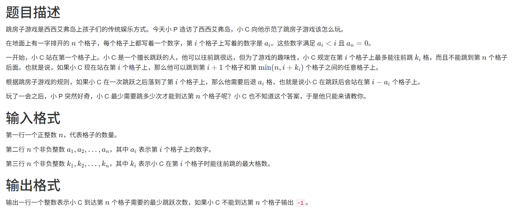

# 1435. 跳房子 (CSP 202412-4)

> 当前文件由 YOJ 原始题面快照的题面主体离线转换生成。公式尽量转换为 LaTeX，图片优先本地化为 Markdown 图片链接；下载失败时保留原始链接并记录 warning。
> 发布阶段、在线复验和提交形态等动态状态以 [data/problems.json](../../data/problems.json) 为准；本文件只保存题面内容和来源信息。

## 题目信息

- 原题地址：[http://yoj.ruc.edu.cn/index.php/index/problem/detail/pno/1435.html](http://yoj.ruc.edu.cn/index.php/index/problem/detail/pno/1435.html)
- 题目时间限制（题面）：500 ms
- 题目内存限制（题面）：512MiB
- 归档语言：`c`
- 本次 AC 实际耗时（提交详情）：327 ms
- 本次 AC 实际内存占用（提交详情）：2428 KB

---



## 样例1输入

```
10
0 1 1 1 1 3 1 0 3 0
2 4 5 4 1 4 1 3 5 3
```

## 样例1输出

```
4
```

## 样例1解释

从第 11 个格子出发，首先往前跳 22 格到第 33 个格子，然后后退一格，停在第 22 个格子。

从第 22 个格子往前跳 33 个格子到第 55 个格子，后退一格，停在第 44 个格子。

从第 44 个格子往前跳 44 个格子到第 88 个格子，不需要后退，停在第 88 个格子。

从第 88 个格子往前跳两格即到达第 1010 个格子。总共跳跃 44 次。

## 样例2输入

```
5
0 1 2 3 0
3 4 4 10 15
```

## 样例2输出

```
-1
```

## 子任务

本题采用捆绑测试，你只有通过一个子任务中的所有测试点才能得到该子任务的分数。

- 子任务一（3030 分）：保证 n≤1000n≤1000；
- 子任务二（3030 分）：保证 ∀1≤i<j≤n∀1≤i<j≤n 都有 ki≤kjki≤kj；
- 子任务三（4040 分）：无特殊限制。

对于所有数据，保证 1≤n≤105,0≤ai<i,1≤ki≤1091≤n≤105,0≤ai<i,1≤ki≤109。

## 提示

本题输入量较大，请采用效率较高的读入方式。
