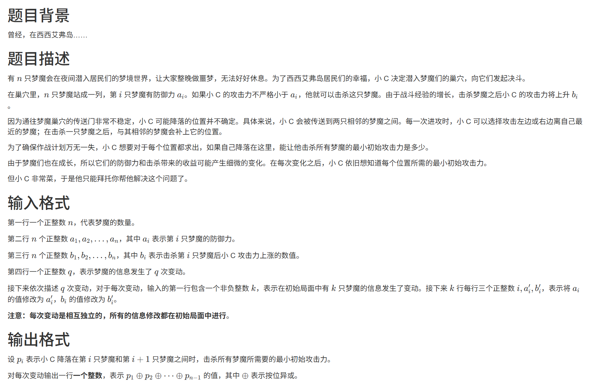
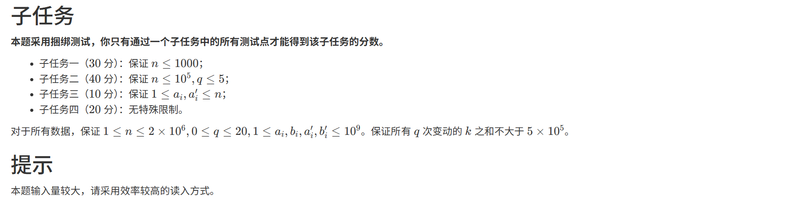

# 1531. # 1531 . 梦魇(CSP 202412-5)

> 当前文件由 YOJ 原始题面快照的题面主体离线转换生成。公式尽量转换为 LaTeX，图片优先本地化为 Markdown 图片链接；下载失败时保留原始链接并记录 warning。
> 当前版本已完成清洗、本地门禁、YOJ Accepted 复验和源码回收，可作为公开版本。

## 题目信息

- 原题地址：[http://yoj.ruc.edu.cn/index.php/index/problem/detail/pno/1531.html](http://yoj.ruc.edu.cn/index.php/index/problem/detail/pno/1531.html)
- 题目时间限制（题面）：5000 ms
- 题目内存限制（题面）：512MiB
- 归档语言：`cpp17`
- 本次 AC 实际耗时（提交详情）：未记录
- 本次 AC 实际内存占用（提交详情）：未记录

---



## 样例输入

```
6
4 9 3 1 7 7
4 2 1 3 1 4
2
2
3 8 1
5 4 3
0
```

## 样例输出

```
9
1
```

## 样例解释

第一次变动后有 \(p_{1}=5,p_{2}=8,p_{3}=1,p_{4}=1,p_{5}=4\)。

第二次变动后有 \(p_{1}=5,p_{2}=3,p_{3}=3,p_{4}=3,p_{5}=7\)。

注意第一次变动对第二次变动不产生影响。



---

## 归档状态

- 题面转换：`CONVERTED_FROM_HTML_SNAPSHOT`
- 代码状态：`PUBLIC_READY`（清洗候选已通过发布门禁）
- 在线 AC 复验：`ONLINE_ACCEPTED`
- 直接提交分块：`VERIFIED`
