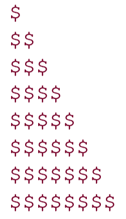

# 1551. 宝藏密码

> 当前文件由 YOJ 原始题面快照的题面主体离线转换生成。公式尽量转换为 LaTeX，图片优先本地化为 Markdown 图片链接；下载失败时保留原始链接并记录 warning。
> 发布阶段、在线复验和提交形态等动态状态以 [data/problems.json](../../data/problems.json) 为准；本文件只保存题面内容和来源信息。

## 题目信息

- 原题地址：[http://yoj.ruc.edu.cn/index.php/index/problem/detail/pno/1551.html](http://yoj.ruc.edu.cn/index.php/index/problem/detail/pno/1551.html)
- 题目时间限制（题面）：1000 ms
- 题目内存限制（题面）：256MiB
- 归档语言：`c`
- 本次 AC 实际耗时（提交详情）：88 ms
- 本次 AC 实际内存占用（提交详情）：496 KB

---

有一天，小R获得了海盗船长杰克藏在小海岛上的宝箱，为了考验小R对**循环知识**的掌握，船长要求必须输出一个由美元符号$组成的“黄金阶梯”密码才能打开宝箱。

**【输入格式】**

**输入一个行数n**

****

**【输出格式】**

**“黄金阶梯”由n行美元符号$组成，其中第一行有1个美元符号$，第二行有2个美元符号$ ......，第n行有n个美元符号$。**

**美元符**号$请******按住shift后再按4。**

**请注意两个$之间没有空格！**

****

**【数据范围】**

其中0<=n<=100

**小R发现n可能等于0，当n=0时，请不要输出任何字符**

**由于n实在是太大了，所以小R觉得必须使用循环结构才可以完成这项任务******

**【样例】**

输入：

5

输出：

$

$$

$$$

$$$$

$$$$$
