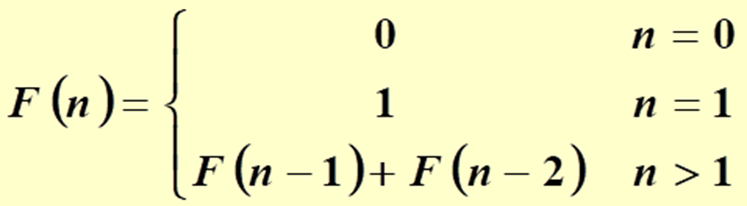

# 1576. 斐波那契数列

> 当前文件由 YOJ 原始题面快照的题面主体离线转换生成。公式尽量转换为 LaTeX，图片优先本地化为 Markdown 图片链接；下载失败时保留原始链接并记录 warning。
> 发布阶段、在线复验和提交形态等动态状态以 [data/problems.json](../../data/problems.json) 为准；本文件只保存题面内容和来源信息。

## 题目信息

- 原题地址：[http://yoj.ruc.edu.cn/index.php/index/problem/detail/pno/1576.html](http://yoj.ruc.edu.cn/index.php/index/problem/detail/pno/1576.html)
- 题目时间限制（题面）：1000 ms
- 题目内存限制（题面）：256MiB
- 归档语言：`cpp`
- 本次 AC 实际耗时（提交详情）：73 ms
- 本次 AC 实际内存占用（提交详情）：512 KB

---

无穷数列1,1,2,3,5,8,13,21,34,55.…..，被称为斐波那契数列，该数列可用如下F函数表示：

 

  请用递归的方法计算斐波那契数列的第n项，你只需补全代码中的递归函数F，提交你补全部分的代码。

  输入：

 一个数字n。

  输出：

 一个数字，斐波那契数列第n项的数字F(n)。

## 题面下载资源

- [下载代码文件](assets/01_1576.cpp)（状态：`CACHED`）
