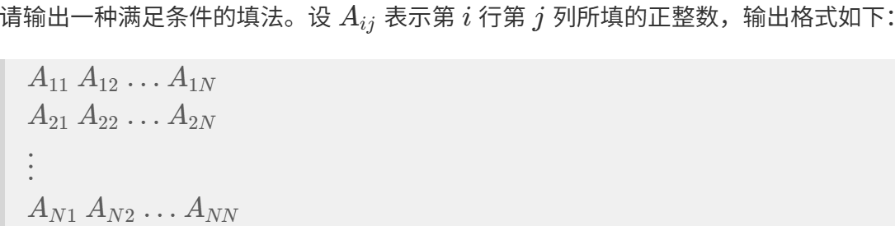

# 1591. matrix

> 当前文件由 YOJ 原始题面快照的题面主体离线转换生成。公式尽量转换为 LaTeX，图片优先本地化为 Markdown 图片链接；下载失败时保留原始链接并记录 warning。
> 当前仓库阶段：`RAW_CAPTURED`。代码尚未完成脱敏清理、版本规范化、提交形态核验和在线复验。

## 题目信息

- 原题地址：[http://yoj.ruc.edu.cn/index.php/index/problem/detail/pno/1591.html](http://yoj.ruc.edu.cn/index.php/index/problem/detail/pno/1591.html)
- 题目时间限制（题面）：1000 ms
- 题目内存限制（题面）：256MiB
- 归档语言：`cpp`
- 本次 AC 实际耗时（提交详情）：297 ms
- 本次 AC 实际内存占用（提交详情）：5448 KB

---

避免质数之和

题目描述

给定一个正整数 N。

请在一个 N行 N 列的网格的每个格子中，各填入一个不超过 N^2的正整数，使得以下所有条件都成立：

- 任意两个在上下左右四个方向上相邻的格子中所填的正整数之和，都不是素数。

- 所有不超过 N^2 的正整数恰好各出现一次。

在本题的限制条件下，可以证明一定存在一种满足条件的填法。

输入格式

输入从标准输入中按以下格式给出。

N

输出格式

如果存在多种满足条件的填法，输出任意一种均可。

输入输出样例 #

输入 #1

4

输出 #1

15 11 16 12

13 3 6 9

14 7 8 1

4 2 10 5

说明/提示

限制

3 <= N <= 1000

样例解释 1

在这个网格中，1到 16 的所有正整数各出现了一次。相邻两个格子的数字之和如 15+11=26、11+16=27、15+13=28 等，均不是素数。

---

## 归档状态

- 题面转换：`CONVERTED_FROM_HTML_SNAPSHOT`
- 代码状态：`RAW_CAPTURED`（不可视为已清洗的公开题解）
- 在线 AC 复验：`NOT_RUN`
- 直接提交分块：`UNKNOWN_UNTIL_FORM_MAP`
