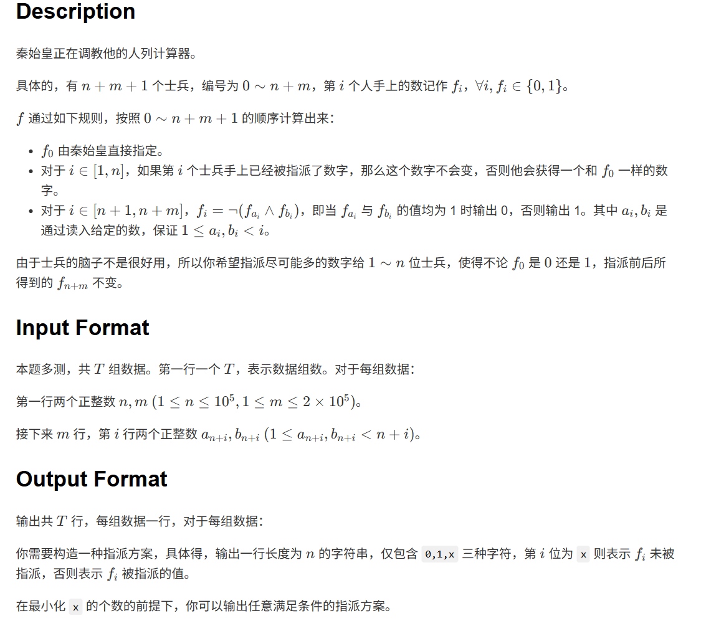

# 1592. # 1592 . 秦始皇

> 当前文件由 YOJ 原始题面快照的题面主体离线转换生成。公式尽量转换为 LaTeX，图片优先本地化为 Markdown 图片链接；下载失败时保留原始链接并记录 warning。
> 当前版本已完成清洗、本地门禁、YOJ Accepted 复验和源码回收，可作为公开版本。

## 题目信息

- 原题地址：[http://yoj.ruc.edu.cn/index.php/index/problem/detail/pno/1592.html](http://yoj.ruc.edu.cn/index.php/index/problem/detail/pno/1592.html)
- 题目时间限制（题面）：5000 ms
- 题目内存限制（题面）：256MiB
- 归档语言：`cpp17`
- 本次 AC 实际耗时（提交详情）：未记录
- 本次 AC 实际内存占用（提交详情）：未记录

---



#### 样例输入1

```
1
2 1
1 2
```

#### 样例输出1

```
x1
```

#### 样例解释1

- 当 \(x=0\)，指派前后前 \(n\) 个士兵的数字分别是 00 和 01，\(f_{n+m}\) 都是 \(1\)。
- 当 \(x=1\)，指派前后前 \(n\) 个士兵的数字都是 11，\(f_{n+m}\) 都是 \(0\)。

#### 样例输入2

```
1
5 10
3 1
3 6
5 6
3 6
5 5
9 1
3 2
12 2
13 1
4 10
```

#### 样例输出2

```
00101
```

## Hint

\(1\le T\le 5,1\le n\le 2\times {10}^{4},1\le m\le 4\times {10}^{4}\)。

特别的，对于 \(10\%\) 的数据，额外满足 \(n\le 5,m\le 10\)。

---

## 归档状态

- 题面转换：`CONVERTED_FROM_HTML_SNAPSHOT`
- 代码状态：`PUBLIC_READY`（清洗候选已通过发布门禁）
- 在线 AC 复验：`ONLINE_ACCEPTED`
- 直接提交分块：`VERIFIED`
